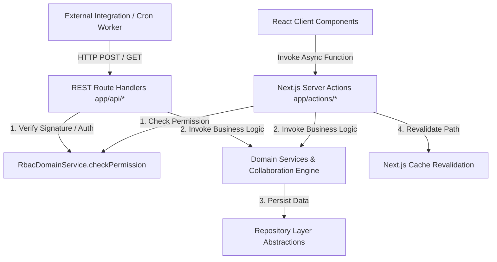

# RANDOM FRAMES OS — API ARCHITECTURE SPECIFICATION

**Document Version:** 1.0 (Permanently Frozen)  
**Classification:** Core Architectural Pillar  
**Status:** Certified & Locked

---

## 1. Purpose
This document specifies the internal and external API Architecture within Random Frames OS. It governs Next.js Server Actions for UI mutations, REST Route Handlers (`app/api/*`) for webhooks and background jobs, strict data validation, and automated error containment.

## 2. Responsibilities
* **Server Actions as Mutation Boundaries:** Server Actions (`app/actions/*`) serve as exclusive bridges between React client interactive components and underlying Domain Services.
* **REST Route Handlers for External Communication:** API endpoints in `app/api/*` process third-party inbound integrations (Web3Forms lead webhooks, OAuth callback redirects, PDF generating pipelines, and cron background queue execution loops).
* **Strict Layer Insulation:** Guarantees that neither Server Actions nor API route endpoints execute business logic directly; all API controllers must immediately delegate execution into authorized Domain Services or Repositories.
* **Standardized Error Containment:** Transforms domain exceptions and RBAC authorization rejections into safe, structured JSON response payloads (`{ success: boolean, data?: any, error?: string }`).

## 3. Architecture Diagram

## 4. Data Flow
1. **Invocation:** An operational staff member triggers a form submission (e.g., generating an Invoice in `invoice-generator.tsx`), calling a server action in `app/actions/finance.ts`.
2. **Security Verification:** The Server Action extracts the caller's identity session token and invokes `RbacDomainService.checkPermission(user.role, 'finance.manage')`. If unauthorized, it terminates early and logs an governance attempt in `AuditManager`.
3. **Domain Delegation:** The Server Action invokes `FinanceDomainService.generateInvoice(payload)`. Zero calculation logic exists inside the action file itself.
4. **Cache Revalidation:** After domain persistence completes successfully, the Server Action calls `revalidatePath('/finance')` to refresh server-rendered cache state cleanly without page reloads.
5. **Structured Return:** A consistent result wrapper (`{ success: true, invoice: createdData }`) is returned to the calling React client component.

## 5. Dependencies
* **Framework Layer:** Next.js App Router (`app/actions/*`, `app/api/*`, and Next Cache runtime).
* **Security & Domain Logic:** `frontend/domain/*`
* **PDF Rendering API:** `app/api/pdf/quotation/[id]/route.tsx` & `app/api/pdf/invoice/[id]/route.tsx`

## 6. Extension Points
* **New Server Actions:** Future features must add dedicated TypeScript action files under `app/actions/<feature>.ts` that strictly map parameters and call corresponding Domain Services.
* **New API Routes:** Webhooks or REST integrations must reside inside `app/api/<provider>/route.ts`, applying strict token and parameter validation before invoking domain layers.

## 7. Future Scalability
* **100+ Concurrent User Operations:** Server Actions run over Next.js serverless operational runtime environments, enabling infinite horizontal worker scaling during concurrent multi-user operations.
* **REST & RPC Compatibillity:** By isolating all business rules inside `domain/`, future enterprise iterations can expose public REST or GraphQL API gateways to third-party mobile apps simply by putting thin API wrappers over existing Domain Services.

## 8. Developer Guidelines
* **No Business Logic in Server Actions:** A server action file must act solely as an authorization check, argument formatter, and Domain Service caller.
* **No Direct Prisma Imports in Actions:** Do not instantiate raw database queries in `app/actions/*` or `app/api/*`; always rely on Repositories or Domain Services.
* **Validate Inputs Early:** Always validate parameters and file IDs at the very edge of the Server Action or API Route before passing data into domain calculations.

## 9. Files Involved
* `frontend/app/actions/*`: All mutations (Leads, Clients, Projects, Shoots, Finance, Team, Settings, Integrations).
* `frontend/app/api/*`: Webhooks (`web3forms`), cron jobs (`process-queue`), OAuth callbacks (`auth/google`), and PDF generation streaming routes.
* `frontend/domain/*`: All consumed business domain capabilities.

## 10. Known Constraints
* **Action Timeout Limits:** Server Actions executing on standard cloud environments subject to HTTP request duration timeouts; any slow third-party operation must be pushed to `QueueManager`.
* **Static Payload Size:** Large file uploads (such as high-resolution photography deliverables) must upload directly to Google Drive via signed cloud URLs rather than routing raw binary streams through Next.js server memory.

## 11. Things That Must Never Be Modified Without Architecture Review
1. **Layer Isolation Rules:** Writing monolithic business calculation code directly inside Server Actions or API routes is strictly prohibited.
2. **RBAC Edge Enforcement:** Removing `RbacDomainService` authorization checks from Server Action invocation boundaries is forbidden.
3. **Error Exposure Protection:** Never return raw database stack traces or unencrypted system paths in client-facing API responses.
