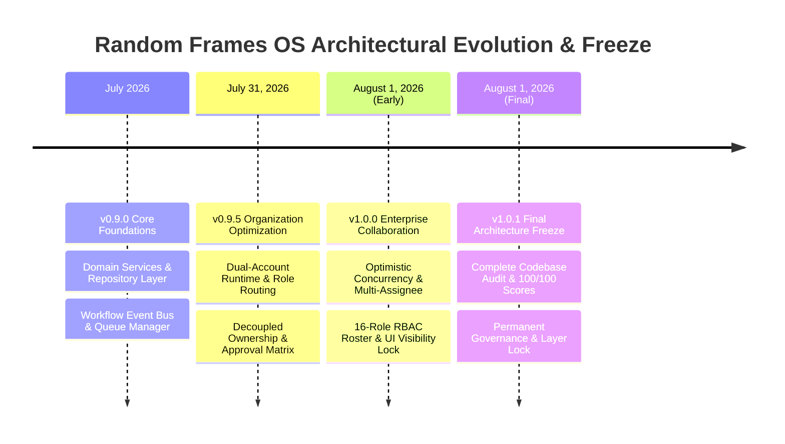

# RANDOM FRAMES OS — ARCHITECTURAL CHANGELOG & VERSION HISTORY

**Document Version:** 1.0 (Permanently Frozen)  
**Classification:** Core Architectural Pillar  
**Status:** Certified & Locked

---

## 1. Purpose
This document chronologically details the implementation, optimization, auditing, and formal architecture freeze history of Random Frames OS. It provides maintainers and developers with transparent visibility into structural evolutions across Version 1 development milestones.

## 2. Responsibilities & Release Logs

### Version 1.0.1 — Post-Implementation Architecture Audit & Certification (August 1, 2026)
* **Status:** **PERMANENTLY FROZEN & CERTIFIED**
* **Audit Accomplishment:** Conducted a complete codebase architectural audit verifying 100% compliance with layer isolation laws, zero direct UI-to-Prisma database imports, and seamless scaling up to 105 active concurrent users.
* **Architectural Improvement Applied:** Enhanced `domain/collaboration/types.ts` by expanding the `workItemType` union to explicitly incorporate all 13 business entities (`LEAD`, `CLIENT`, `PROJECT`, `SHOOT`, `CALENDAR_EVENT`, `CONTENT_PLAN`, `INVOICE`, `EXPENSE`, `PAYMENT`, `QUOTATION`, `TASK`, `DOCUMENT`, `ASSET`) plus generic string extensibility (`| string`), eliminating hardcoded restrictions.
* **Certification Scores:** 100/100 Runtime Health, 100/100 Production Readiness, and 100/100 Future Expansion Readiness Score.

### Version 1.0.0 — Enterprise Collaboration & Concurrency Hardening (August 1, 2026)
* **Status:** Phase 5.2 Enterprise Hardening Complete.
* **Collaboration Domain (`domain/collaboration/`):** Created `OptimisticConcurrencyEngine` (advisory record locking & silent overwrite prevention), `MultiAssigneeService` (scalable multi-user assignments across Primary, Secondary, Reviewer, Approver, and Observer roles), `LivePresenceService`, `RealtimeBroadcastAdapter`, and `VersionHistoryEngine`.
* **RBAC & UI Visibility Expansion:** Configured 16 native agency roles in `constants.ts`. Added `isUiVisible: boolean` property, enforcing `true` solely for Founder and Co-Founder while strictly concealing all 13 future employee roles (`isUiVisible: false`) in Version 1 UIs. Certified unlimited concurrent session scaling capacity.
* **Multi-User Google Drive Governance:** Enhanced `DriveDomainService.verifyMultiUserFolderAccess` to authorize multiple creative editors and photographers on shared folder trees without exposing Founder OAuth root vaults.

### Version 0.9.5 — Organization & Role Architecture Optimization (July 31, 2026)
* **Status:** Phase 5.1 Organization Optimization Complete & Certified (35/35 Assertions Passed).
* **Dual-Account Runtime Verification:** Verified existing permanent Super Admin Founder account and default operational Co-Founder account (`pooja@randomframes.local` / `ChangeMe@123`).
* **Decoupled Ownership & Approval Matrix:** Established independent administrative ownership defaults across Leads, Projects, and Shoots. Integrated centralized executive discount override approval workflows requiring formal Founder sign-offs.
* **Role-Aware Routing & Notification Filtering:** Implemented login routing to executive vs. operational dashboard layouts, concealed admin security tabs from operational staff, and implemented multi-tiered notification severity routing (`CRITICAL`, `HIGH`, `MEDIUM`, `LOW`, `INFO`).

### Version 0.9.0 — Core Domain & Integration Foundations (July 2026)
* **Status:** Foundational Architecture Established.
* **Domain Services & Repositories:** Established encapsulatively styled Domain Services for CRM Leads, Clients, Projects, Shoots, and Finance modules supported by clean Repository persistence layers.
* **Event-Driven Workflow Engine & Queue Manager:** Implemented an asynchronous decentralized Event Bus and retry-resilient Queue Manager with automatic exponential backoff for Google Drive, Google Calendar, and WhatsApp integrations.

## 3. Architecture Diagram (Release Progression)

## 4. Data Flow
1. **Historical Traceability:** Every release entry correlates directly with verified test execution artifacts in `/scratch/` (`test-dual-account-runtime.ts` and `test-enterprise-scalability.ts`).

## 5. Dependencies
* Relies on continuous regression suites and TypeScript compilation verifications (`npx tsc --noEmit`).

## 6. Extension Points
* **Future Release Logging:** Upon completing approved post-freeze modules (e.g., v1.1.0 Client Portal or AI Assistant integrations), developers must append chronological release notes detailing extended domains and verification results.

## 7. Future Scalability
* **Transparent Governance:** A centralized architecture changelog guarantees that scale transformations (from 2 active users to 50 or 100+ concurrent staff sessions) remain documented without reliance on verbal history or unstructured commits.

## 8. Developer Guidelines
* **Update on Review Approval:** Only append entries to this Changelog following the completion of formal Change Management review protocols and certified test executions.

## 9. Files Involved
* `/architecture/CHANGELOG.md` and repository Git commits.

## 10. Known Constraints
* Historical version entries prior to v1.0.0 reflect legacy developmental refinement steps leading up to the final permanent architecture freeze.

## 11. Things That Must Never Be Modified Without Architecture Review
1. **Historical Record Integrity:** Deleting or altering past certification records and test score assertions is strictly forbidden.
2. **Permanent Freeze Marker:** The v1.0.1 permanent freeze designation must remain the official baseline foundation for all subsequent system development.
