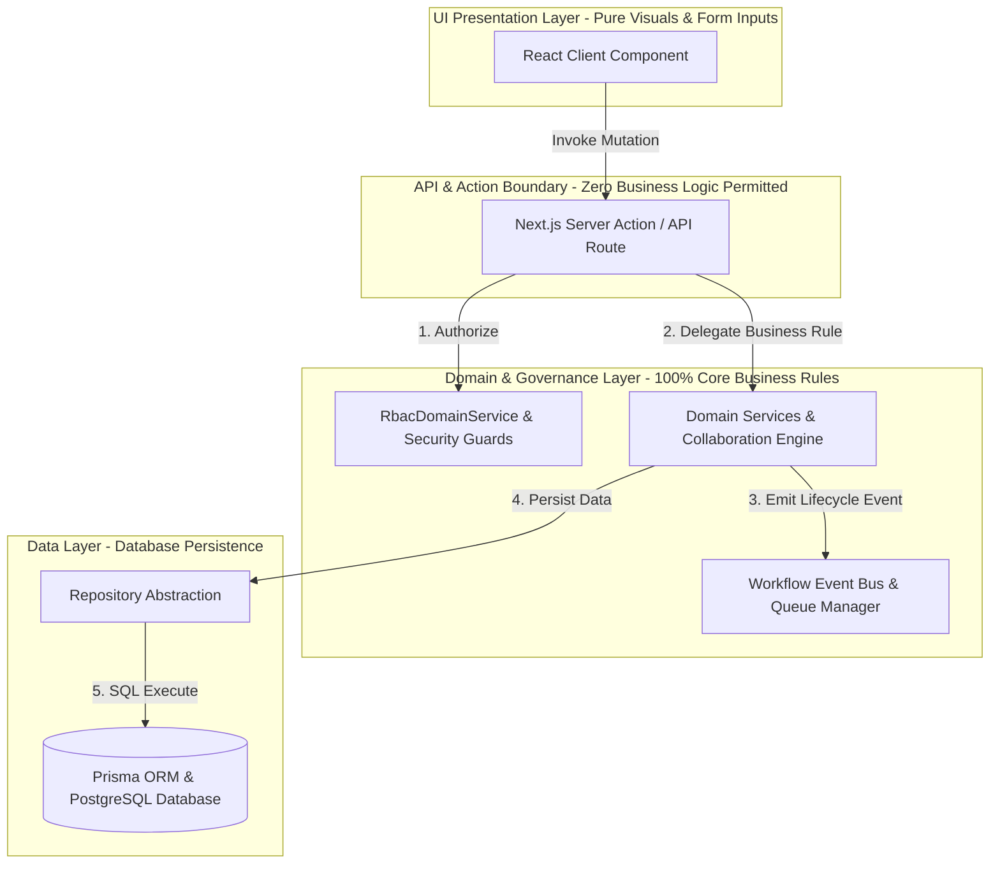

# RANDOM FRAMES OS — MANDATORY CODING STANDARDS & ARCHITECTURAL GOVERNANCE

**Document Version:** 1.0 (Permanently Frozen)  
**Classification:** Core Architectural Pillar  
**Status:** Certified & Locked

---

## 1. Purpose
This document establishes the binding coding standards, layer encapsulation laws, and development guardrails that every contributor, software developer, and AI assistant must follow when contributing to Random Frames OS. Violation of these standards constitutes an immediate architectural breach.

## 2. Mandatory Coding Standards & Layer Laws
To maintain certified Runtime Health (100/100) and Production Readiness (100/100), the following structural rules are non-negotiable:
1. **No Direct Prisma Access from UI:** React Client components (`frontend/components/*`) must NEVER import `@/lib/prisma` or execute database queries directly. Imports from `"@prisma/client"` in components are strictly restricted to TypeScript type definitions and status enums.
2. **No Business Logic Inside React Components:** UI components exist exclusively for visual representation, state rendering, and user input collection. Calculation formulas, discount validation rules, pricing matrices, and role access calculations must never reside inside React component state or effects.
3. **No Business Logic Inside Server Actions:** Next.js Server Actions (`app/actions/*`) serve solely as protocol mutation boundary interfaces. They may only perform basic authentication verification, parameter validation, and invocation of corresponding Domain Services.
4. **Repositories Handle Persistence:** All database interaction operations must pass strictly through the Repository Layer (`domain/repositories/*`), insulating core domain logic from direct database coupling.
5. **Domain Services Handle Business Logic:** 100% of business domain logic (Leads, Clients, Projects, Shoots, Finance, Content, Calendar, Collaboration) must be encapsulated inside clean service classes in `/frontend/domain/*`.
6. **Workflow Engine Handles Orchestration:** Cross-domain process transitions (e.g., converting a Quotation into a Project and generating Google Drive folder hierarchies) must trigger via event emission over the centralized asynchronous Workflow Event Bus (`lib/workflow/*`), never through direct service-to-service API coupling.
7. **Notification Engine Handles Communication:** All internal CRM feed updates, email reminders, and WhatsApp alerts must be dispatched through `NotificationDomainService` following multi-tiered priority severity classification (`CRITICAL`, `HIGH`, `MEDIUM`, `LOW`, `INFO`).
8. **Queue Manager Handles Asynchronous Execution:** Slow third-party network integrations (Google Drive API, Google Calendar API, WhatsApp Cloud REST endpoints) must never execute synchronously within interactive user mutation loops. They must be pushed as jobs into `QueueManager` with automatic exponential backoff retries.
9. **RBAC Controls Authorization:** All sensitive actions must execute an upfront check against `RbacDomainService.checkPermission(user.role, requiredAction)`. The Founder Super Admin universal bypass must never be suppressed.
10. **Optimistic Concurrency Guards:** Record edits on shared documents and deliverables must utilize `OptimisticConcurrencyEngine` row version validation to ensure zero silent overwrites occur during concurrent editing sessions.

## 3. Architecture Diagram

## 4. Data Flow & Compliance Audit Checklist
Before submitting code or generating features, verify compliance against this checklist:
* [ ] Does the UI React component import `@/lib/prisma`? *(If Yes -> REJECT IMMEDIATELY)*
* [ ] Does a Server Action calculate pricing or discount limits internally? *(If Yes -> Move logic to `FinanceDomainService`)*
* [ ] Is a synchronous external HTTP fetch executed inside a server action? *(If Yes -> Wrap in `QueueManager.pushJob`)*
* [ ] Is a new employee role appearing in Version 1 UI user menus? *(If Yes -> Check `RbacDomainService.getUiVisibleRoles()` filtering)*
* [ ] Are simultaneous edits overwriting data silently without version error prompts? *(If Yes -> Incorporate `OptimisticConcurrencyEngine`)*

## 5. Dependencies
* **Enforcement Tools:** Automated type verification (`npx tsc --noEmit`) and repository compliance audit test suites (`scratch/test-enterprise-scalability.ts`).

## 6. Extension Points
* **Refactoring Legacy Code:** If older codebase areas exhibit minor logic leakage into UI server actions during maintenance, refactor them immediately to pass through dedicated Domain Services without changing user functionality.

## 7. Future Scalability
* **Consistent Coding Disciplines:** Adhering strictly to layered boundaries ensures that adding future developers or AI assistants will never degrade runtime stability or introduce tangled dependency loops, preserving 100/100 health scores as the application scales to 100+ concurrent users.

## 8. Developer Guidelines
* **No Placeholder or Mock Code:** Written domain integrations must be fully functional and certified; placeholder methods or fake mock implementations are strictly prohibited in production branches.
* **Preserve Visual Excellence & Locked UI:** Existing home dashboard designs, sidebar placements, and widget layouts are permanently locked and must remain visually identical unless an explicit redesign directive is authorized.

## 9. Files Involved
* Applicable across every `.ts`, `.tsx`, and `.js` source code file within the Random Frames OS repository.

## 10. Known Constraints
* **TypeScript Strict Coverage:** Zero TypeScript build compilation errors (`0 errors`) must be maintained across the entire workspace prior to merging code changes.

## 11. Things That Must Never Be Modified Without Architecture Review
1. **Layer Decoupling Laws:** Any attempt to merge UI components directly with database drivers or bypass domain services is permanently forbidden.
2. **CRM Reliability Guarantee:** No third-party network failure may ever propagate upward to trigger a 500 fatal crash in user CRM operations.
3. **Founder Universal Bypass:** The Super Admin Founder bypass behavior must remain immutable across all code modules.
