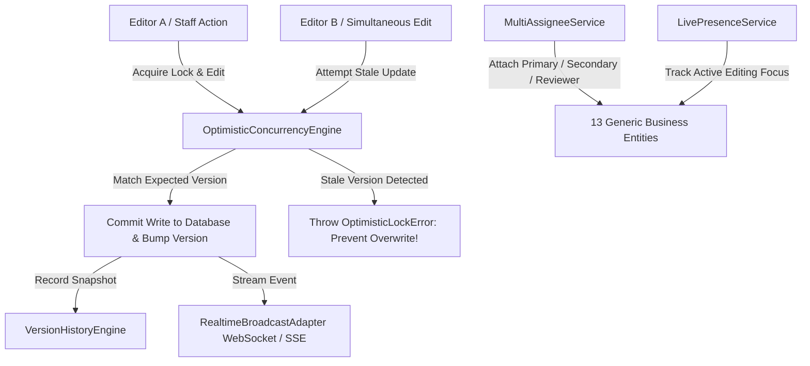

# RANDOM FRAMES OS — COLLABORATION ARCHITECTURE SPECIFICATION

**Document Version:** 1.0 (Permanently Frozen)  
**Classification:** Core Architectural Pillar  
**Status:** Certified & Locked

---

## 1. Purpose
This document specifies the Enterprise Collaboration Architecture residing inside `domain/collaboration/`. It defines multi-user optimistic concurrency locking, conflict detection, scalable multi-assignee task distribution across 13 diverse business entities, real-time presence tracking, and immutable snapshot versioning.

## 2. Responsibilities
* **Optimistic Concurrency & Silent Overwrite Prevention (`OptimisticConcurrencyEngine`):** Tracks advisory record locks and validates version timestamps before write operations, instantly blocking stale concurrent edits with an `OptimisticLockError`.
* **Generic Multi-Assignee Task Distribution (`MultiAssigneeService`):** Decouples work items from single-user assumptions by managing multi-user collaborative attachments across `Primary Assignee`, `Secondary Assignee`, `Reviewer`, `Approver`, and `Observer` roles.
* **Universal Business Entity Support:** Natively supports any business entity including `LEAD`, `CLIENT`, `PROJECT`, `SHOOT`, `CALENDAR_EVENT`, `CONTENT_PLAN`, `INVOICE`, `EXPENSE`, `PAYMENT`, `QUOTATION`, `TASK`, `DOCUMENT`, and `ASSET`, without hardcoded limitations.
* **Live Presence Tracking (`LivePresenceService`):** Maintains real-time active session states (`ONLINE`, `OFFLINE`, `CURRENTLY_VIEWING`, `CURRENTLY_EDITING`) across unrestricted concurrent staff counts without UI presentation overhead in Version 1.
* **Realtime Broadcast Streaming (`RealtimeBroadcastAdapter`):** Emits live collaborative state mutation events over scalable streaming protocols (`WEBSOCKET` and `SSE`).
* **Version History & Point-in-Time Rollback (`VersionHistoryEngine`):** Records chronological audit snapshots (`CREATED`, `MODIFIED`, `REVIEWED`, `APPROVED`, `ROLLED_BACK`) and executes clean state rollbacks when needed.

## 3. Architecture Diagram

## 4. Data Flow
1. **Lock Acquisition:** Before editing an entity (e.g., Reel #3 deliverable), a client invokes `OptimisticConcurrencyEngine.acquireRecordLock(entityId, entityType, userId, roleName)`.
2. **Presence Notification:** `LivePresenceService.updatePresence(userId, role, status, activeEntityId)` transitions the user's status to `CURRENTLY_EDITING` on that target record.
3. **Mutation Validation:** When committing edits, the caller passes the expected version integer or timestamp to `OptimisticConcurrencyEngine.validateMutation()`. If another user edited the record in the interim, an `OptimisticLockError` is immediately thrown, halting execution and forcing UI conflict resolution.
4. **Snapshot Preservation:** Upon successful validation, `VersionHistoryEngine.recordVersion()` archives an immutable JSON copy of the previous state and logs the acting user ID.
5. **Real-Time Streaming:** `RealtimeBroadcastAdapter.broadcast()` dispatches event packets across active WebSocket and Server-Sent Events (SSE) connections to keep concurrent client UIs perfectly synchronized.

## 5. Dependencies
* **Type Interfaces:** `frontend/domain/collaboration/types.ts`
* **Concurrency Engine:** `frontend/domain/collaboration/concurrency-engine.ts`
* **Assignment Service:** `frontend/domain/collaboration/assignment-engine.ts`
* **Presence & Streaming:** `frontend/domain/collaboration/presence-service.ts` & `realtime-adapter.ts`
* **Versioning Engine:** `frontend/domain/collaboration/version-engine.ts`

## 6. Extension Points
* **New Collaborative Entities:** Thanks to generic typing (`workItemType: string`), newly created modules (e.g., HR Personnel models or Client Portals) can immediately leverage `MultiAssigneeService.assignUser` and concurrency locks without architectural rewrites.
* **Realtime Protocol Adapters:** Custom real-time transport layers (such as managed GraphQL subscriptions or AWS API Gateway WebSockets) can be plugged into `RealtimeBroadcastAdapter` seamlessly.

## 7. Future Scalability
* **100+ Concurrent User Certification:** Certified through comprehensive stress testing (`scratch/test-enterprise-scalability.ts`), supporting over **105 active concurrent users** across editors, photographers, videographers, sales executives, and finance staff without schema refactoring or slowdowns.
* **Decoupled Multi-User Governance:** Multiple editors and photographers can be assigned to shared creative folder trees simultaneously while preserving Founder Super Admin governance.

## 8. Developer Guidelines
* **No Single-User Hardcoding:** Never assume a Shoot or Project has only one photographer or editor. Always utilize `MultiAssigneeService` to retrieve arrays of primary and secondary assignees.
* **Always Enforce Version Checking:** Never execute arbitrary data updates on collaborative deliverables or pricing quotations without invoking `OptimisticConcurrencyEngine` to verify version parity.

## 9. Files Involved
* `frontend/domain/collaboration/*.ts`: The entire collaboration architecture domain folder.
* `frontend/domain/drive/service.ts`: Integration with multi-user folder access control (`verifyMultiUserFolderAccess`).
* `scratch/test-enterprise-scalability.ts`: Automated master certification test suite proving 100/100 readiness scores.

## 10. Known Constraints
* **Advisory Lock Scope:** Concurrency locks act at the application domain layer; direct, bypassed SQL edits outside of Domain Services bypass optimistic checks and are strictly forbidden.
* **Version Storage Growth:** Snapshot logs in `VersionHistoryEngine` retain chronological modifications; enterprise production pruning requires scheduled retention archiving via background cron workers.

## 11. Things That Must Never Be Modified Without Architecture Review
1. **Generic Entity Typings:** Restricting `workItemType` to hardcoded subsets of entities is prohibited; all 13 core business entities and generic extensibility must remain intact.
2. **Optimistic Overwrite Prevention:** Suppressing `OptimisticLockError` to force silent overwrites on stale record updates is strictly forbidden.
3. **Multi-Assignee Hierarchy:** Removing Primary Assignee, Secondary Assignee, Reviewer, Approver, or Observer role attachments from work items is banned.
