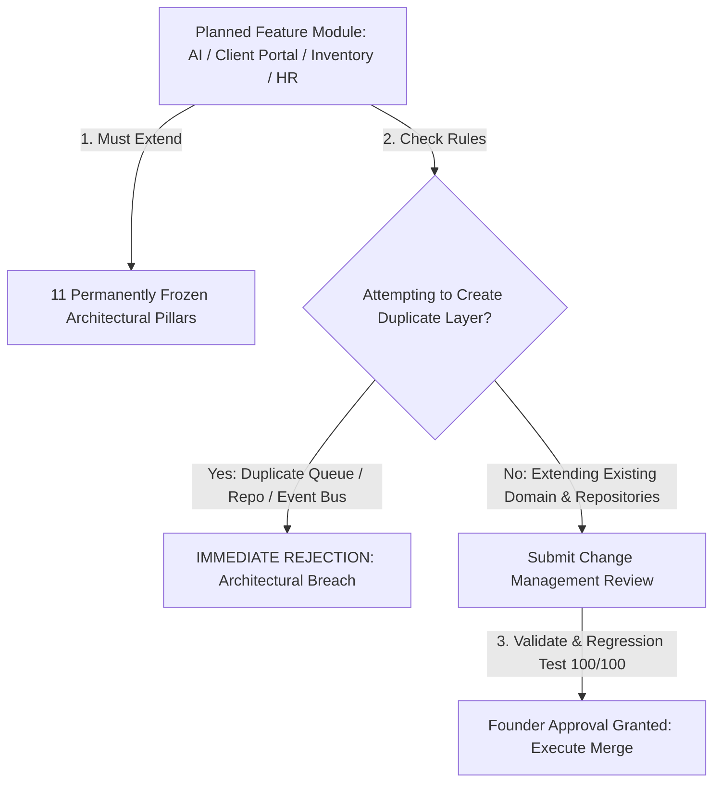

# RANDOM FRAMES OS — CONTRIBUTING GUIDE & ARCHITECTURE GOVERNANCE

**Document Version:** 1.0 (Permanently Frozen)  
**Classification:** Core Architectural Pillar  
**Status:** Certified & Locked

---

## 1. Purpose
This Contributing Guide establishes explicit architectural governance policies, future module integration patterns, and change management procedures for all engineers, AI coding assistants, and maintainers developing Random Frames OS. It ensures every new contribution extends existing systems without creating duplicate layers or violating the permanent architecture freeze.

## 2. Architecture Governance (Permanently Frozen Pillars)
As of Random Frames OS v1.0, the core architecture is officially and **permanently frozen**. The following **11 foundational systems represent permanent architectural pillars**:
1. **RBAC (Role-Based Access Control)**
2. **Workflow Engine**
3. **Notification Engine**
4. **Queue Manager**
5. **Repository Layer**
6. **Domain Services**
7. **Collaboration Domain**
8. **Audit Manager**
9. **Activity Manager**
10. **Timeline Manager**
11. **Integration Layer**

> [!CAUTION]
> **PROHIBITED ACTION:** Creating duplicate architectural layers, duplicate event buses, duplicate notification mechanisms, custom database query wrappers outside Repositories, or bypassing existing domain services is **strictly prohibited**. Every future feature must evolve strictly through the extension of these existing pillars.

## 3. Future Development Policy & Module Integration
All future modules and extensions must build upon the permanently frozen architecture without introducing new architectural layers or redundant state engines. Below are mandatory implementation guidelines for planned expansions:

### 1. AI Assistant & Automation Workers
* **Integration Rule:** Must connect to the application via `QueueManager.pushJob('AI_ADAPTER', action, payload)`.
* **Data Access:** Must read and write enterprise data strictly by calling authorized Domain Services and Repository abstracts.
* **Auditability:** All automated AI actions must record activity entries in `AuditManager` and `ActivityService`.

### 2. Client Portal & External Interfaces
* **Integration Rule:** Must leverage existing `ClientService`, `ProjectService`, and `DriveDomainService` public APIs.
* **Security & Concurrency:** Must apply `OptimisticConcurrencyEngine` when submitting review feedback on deliverables to prevent silent overwrites with internal editing teams.

### 3. Inventory & Asset Management
* **Integration Rule:** Must reside in dedicated domain folders (`/frontend/domain/inventory/`) implementing standard Domain Service classes and Repository patterns.
* **Collaboration Ready:** Must utilize `MultiAssigneeService.assignUser(..., workItemType: 'ASSET')` to assign equipment responsibility to staff without hardcoded limitations.

### 4. HR, Payroll & Team Management
* **Integration Rule:** Must map staff profiles to the 16 native roles defined in `RbacDomainService` and `constants.ts`. When activating roles in UI, toggle `isUiVisible` cleanly without changing core authorization mechanics.

### 5. Mobile App & REST API Gateways
* **Integration Rule:** Mobile or external client gateways must consume existing Domain Services over Next.js Server Actions or sanitized REST Route Handlers (`app/api/*`), maintaining identical RBAC checks and error formatting wrappers.

## 4. Change Management & Architecture Review Protocol
Modifying core architectural behavior or extending frozen domain contracts requires rigorous formal approval. No contributor may alter core architecture without executing the following mandatory Change Management steps:
1. **Architecture Review:** Submit an implementation plan detailing why existing permanent pillars cannot natively fulfill the desired capability.
2. **Impact Analysis:** Identify all downstream consumers (UI views, background workers, integration adapters) affected by the proposed change.
3. **Dependency Analysis:** Verify that zero circular dependencies or UI-to-Prisma database coupling leaks are introduced.
4. **Regression Testing:** Execute the full master certification suite (`npx tsx scratch/test-enterprise-scalability.ts` and `scratch/test-dual-account-runtime.ts`), guaranteeing **100/100 pass rates** and **0 TypeScript compilation errors** (`npx tsc --noEmit`).
5. **Documentation Update:** Immediately update corresponding markdown reference files inside `/architecture` before merging code.
6. **Explicit User Approval:** Secure explicit approval from the project Founder / Super Admin before executing any source code modifications.

## 5. Architecture Diagram

## 6. Dependencies
* Governs all contributors, automated CI/CD checks, and AI IDE assistant workflows.

## 7. Extension Points
* **Documentation Amendments:** Future approved modules should append specialized markdown specifications directly into the root `/architecture` folder following consistent 11-section formatting requirements.

## 8. Developer Guidelines
* **Read Before Coding:** Always review `SYSTEM_ARCHITECTURE.md`, `CODING_STANDARDS.md`, and this Contributing Guide before commencing feature development.
* **Ask When Unsure:** If an implementation approach seems ambiguous, pause and request clarification or submit an open question in an implementation plan rather than making unverified architectural assumptions.

## 9. Files Involved
* Governs contributions across the entire Random Frames OS codebase and root `/architecture` repository space.

## 10. Known Constraints
* **Immutable Foundation:** Random Frames OS v1.0 is officially architecturally frozen; development shifts from structural building to modular domain extension.

## 11. Things That Must Never Be Modified Without Architecture Review
1. **The Architecture Governance Clause:** Bypassing the prohibition against duplicate architectural layers is permanently forbidden.
2. **Change Management Prerequisite:** Executing direct architectural source code modifications without formal review, regression test validation, and documentation updates is strictly prohibited.
