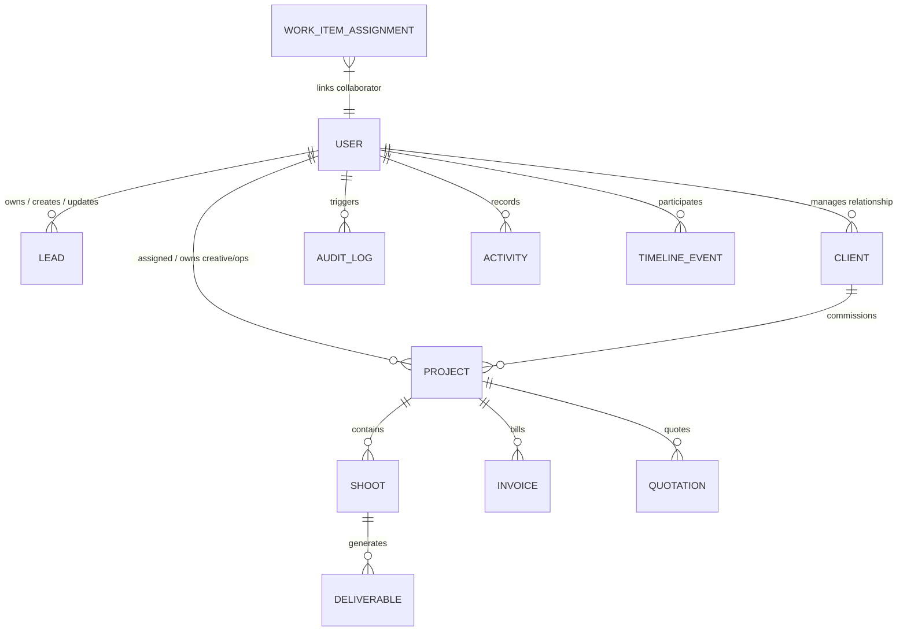

# RANDOM FRAMES OS — DATABASE ARCHITECTURE SPECIFICATION

**Document Version:** 1.0 (Permanently Frozen)  
**Classification:** Core Architectural Pillar  
**Status:** Certified & Locked

---

## 1. Purpose
This document defines the structured Relational Database Architecture governing Random Frames OS. It details entity relational mapping, ownership decoupling from assignment, audit trail serialization, indexing strategies, and strict schema migration governance.

## 2. Responsibilities
* **Data Integrity & Relationships:** Enforces referential integrity between CRM entities (Leads, Clients), Production pipelines (Projects, Shoots, Deliverables, Shot Lists), and Financial records (Invoices, Quotations, Expenses, Payments).
* **Decoupled Ownership vs. Assignment:** Segregates entity administrative owners (`ownerId`, `Sales Owner`, `Operations Owner`, `Creative Owner`, `Finance Owner`, `Relationship Owner`) from functional execution assignees (`assignedToId`, `assignedUsers`, `assignedEditor`, multi-assignee junction tables).
* **Audit Metadata Logging:** Automatically persists immutable creation, modification, and actor tracking fields (`createdAt`, `updatedAt`, `createdBy`, `updatedBy`, `approvedBy`, `completedBy`).
* **Storage Optimization:** Leverages indexing across frequently queried relational foreign keys and high-cardinality status enums.

## 3. Architecture Diagram

## 4. Data Flow
1. **Repository Invocation:** All database queries originate strictly from Repository abstractions (`LeadRepository`, `ClientRepository`, `ProjectRepository`).
2. **Entity Validation:** Prisma ORM validates parameter typing against generated `@prisma/client` bindings.
3. **Transaction Execution:** Multi-table mutations (such as onboarding a Client and instantiating its onboarding Projects and Google Drive vaults) wrap expressions in atomic transactional closures (`prisma.$transaction`).
4. **Audit Propagation:** On record mutations, triggers or repository middlewares capture active actor IDs (`usr_founder`, `usr_co_founder`, etc.) and append them into `createdBy`, `updatedBy`, and dedicated `Activity` / `TimelineEvent` records.

## 5. Dependencies
* **Schema Definition:** `frontend/prisma/schema.prisma`
* **Migration Engine:** Prisma Migrate & introspection tools.
* **Client ORM:** `@prisma/client` singleton initialized inside `frontend/lib/prisma.ts`.
* **Database Driver:** PostgreSQL / Node-Postgres connection pool.

## 6. Extension Points
* **Metadata Fields:** New entities must inherit standard audit timestamps and user ID tracking strings.
* **Junction Tables:** To link multiple staff members without altering core tables, utilize the scalable multi-assignee junction structure mapped in `domain/collaboration/types.ts`.
* **Custom Enums:** Enums (`LeadStatus`, `ProjectStatus`, `ShootStatus`, `PaymentMethod`, etc.) may be expanded with additional state values via standard additive schema migrations.

## 7. Future Scalability
* **Multi-User Headcount Expansion:** Because ownership (`ownerId`) is separated from assignment (`assignedUsers`, `WorkItemAssignment`), scaling from 2 users to 100+ concurrent users requires zero modification to database table schemas.
* **Horizontal Read Pooling:** High-frequency dashboard lookups (Kanban boards, financial summaries) are structured to allow seamless migration to read-replica connection strings without changing repository method signatures.

## 8. Developer Guidelines
* **Database Naming Standards:** Table names must use explicit CamelCase or PascalCase syntax matching domain models; relational field names must use descriptive lowerCamelCase with an explicit `Id` suffix for foreign keys (e.g., `createdById`, `assignedToId`, `clientId`).
* **No Raw Queries:** Never execute raw SQL expressions unless performance bottlenecks in complex analytical aggregations render ORM generation impossible (requires formal Architecture Review approval).
* **Migration Guidelines:** All schema adjustments must be additive where possible. Dropping columns or renaming production enum keys is strictly prohibited without full dependency and regression analysis.

## 9. Files Involved
* `frontend/prisma/schema.prisma`: Single source of truth for entity models and relations.
* `frontend/lib/prisma.ts`: Singleton database client instance.
* `frontend/domain/repositories/*`: Clean abstraction implementation layer.
* `frontend/prisma/seed.ts`: Base bootstrapping scripts for production Founder Super Admin and default operational accounts.

## 10. Known Constraints
* **Foreign Key Cascade Restrictions:** Hard deleting Client records with active financial history (Invoices/Payments) is restricted; archiving or status toggling (`status: "INACTIVE"`) is mandatory.
* **Optimistic Row Versioning:** Collaborative tables rely on integer version counters or precise `updatedAt` comparison timestamps to prevent stale concurrent overrides.

## 11. Things That Must Never Be Modified Without Architecture Review
1. **Existing User Account Identifiers:** The Super Admin Founder credential mapping and table IDs must never be modified, recreated, or wiped.
2. **Decoupled Ownership Structure:** Never conflate Sales Owner, Creative Owner, or Finance Owner into a single monolithic field that blocks specialized multi-user governance.
3. **Audit Tracking Fields:** Removing `createdBy`, `updatedBy`, or timestamp columns from any business model is strictly forbidden.
