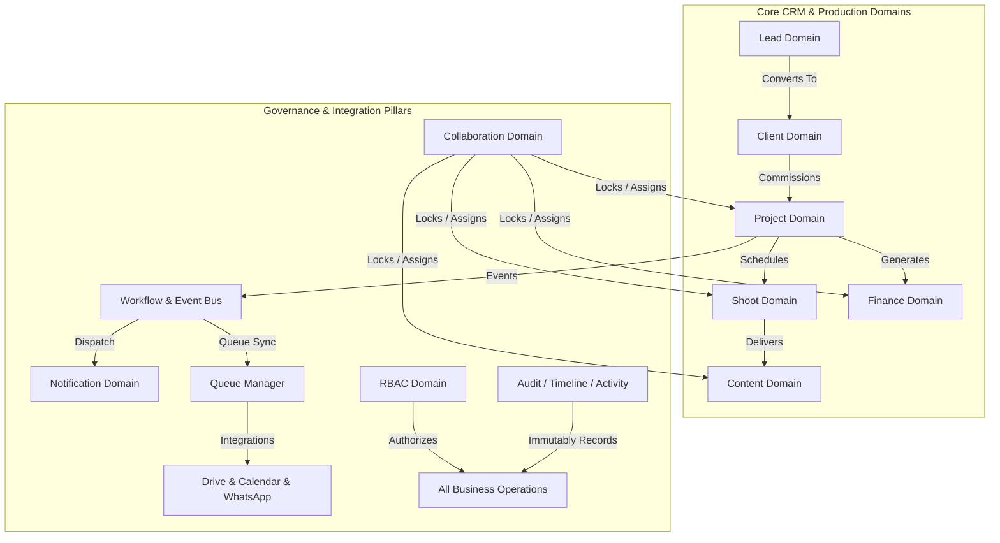

# RANDOM FRAMES OS — DOMAIN ARCHITECTURE SPECIFICATION

**Document Version:** 1.0 (Permanently Frozen)  
**Classification:** Core Architectural Pillar  
**Status:** Certified & Locked

---

## 1. Purpose
This document specifies the Domain-Driven Design (DDD) business architecture powering Random Frames OS. It establishes explicit responsibilities, public APIs, internal domain invariants, and inter-domain communication protocols across every active business and technical domain in the system.

## 2. Responsibilities & Complete Domain Breakdown
Every operational requirement is encapsulated inside a dedicated domain namespace:
1. **Lead Domain (`LeadService`):** Captures inbound inquiries, assigns Sales/Ops owners, manages follow-up reminders, and coordinates automated CRM stage advancement upon conversion.
2. **Client Domain (`ClientService`):** Governs established client account profiles, Relationship Owner mapping, project portfolio aggregation, and billing preferences.
3. **Project Domain (`ProjectService`):** Orchestrates creative photography and filmmaking commissions. Decouples Creative Owner (default: Founder) from Operations Owner (default: Co-Founder).
4. **Shoot Domain (`ShootService`):** Schedules physical productions, coordinates equipment checklists, manages shot lists, and assigns Primary/Secondary Photographers and Videographers.
5. **Finance Domain (`FinanceService`):** Generates and manages Invoices, Quotations, Expenses, and Payments. Governs financial approval hierarchies (e.g., discount override authorizations requiring formal Founder review).
6. **Content Domain (`ContentManager`):** Schedules post-production review loops, social media content calendars, and multi-stage client deliverable sign-offs.
7. **Calendar Domain (`CalendarService`):** Manages internal production agendas, team shoot timetables, and bi-directional integration syncs with Google Calendar.
8. **Drive Domain (`DriveDomainService`):** Governs automated Google Drive root architectures, isolating system OAuth vaults while dynamically managing multi-user creative editing folder trees.
9. **WhatsApp Domain (`WhatsAppService`):** Constructs formatted messaging payloads and schedules transactional client notification dispatch over Meta Cloud APIs.
10. **Notification Domain (`NotificationDomainService`):** Classifies notifications into multi-tiered priority levels (`CRITICAL`, `HIGH`, `MEDIUM`, `LOW`, `INFO`) and filters feeds per user operational scope.
11. **Workflow Domain (`WorkflowEngine`):** Provides an asynchronous, decentralized Event Bus coordinating multi-step automation across disparate domains without direct service coupling.
12. **RBAC Domain (`RbacDomainService`):** Centralizes enterprise role definitions, departmental boundaries, UI visibility toggles, and Super Admin bypass execution.
13. **Collaboration Domain (`domain/collaboration/`):** Manages optimistic concurrency record locking, generic multi-assignee task distribution, live presence tracking, and real-time streaming adapters across all 13 business entities.
14. **Queue Domain (`QueueManager`):** Manages asynchronous integration tasks and exponential backoff retry execution.
15. **Audit Domain (`AuditManager`):** Logs immutable governance trails for authentication, token mutations, and administrative override events.
16. **Timeline Domain (`TimelineManager`):** Compiles cross-domain chronological lifecycles, giving executives instant visibility into entity progression.
17. **Activity Domain (`ActivityManager`):** Records operational task actions, user modifications, and kanban state transfers for auditability.

## 3. Architecture Diagram

## 4. Data Flow
1. **Request Interception:** An incoming authorized action invokes a Domain Service method (e.g., `ProjectService.createProject`).
2. **Business Rule Verification:** The domain validates internal invariants (e.g., confirming project budgets meet minimum threshold configurations or verifying Creative Owner default mappings).
3. **Collaboration Check:** If modifying an existing record, the service requests advisory validation from `OptimisticConcurrencyEngine` and tracks live state in `LivePresenceService`.
4. **Repository Invocation:** The service executes persistence updates via injected Repository interfaces.
5. **Event Bus Broadcast:** Upon database commit, an event is emitted over `WorkflowEngine` (e.g., `PROJECT_CREATED`), causing synchronous timeline logging and asynchronous queue tasks (creating Drive client folders) to fire independently.

## 5. Dependencies
* **Internal Layers:** Domain Services rely strictly on the Repository Layer for persistence and the RBAC Domain for access authorization.
* **Type Definitions:** Explicit domain types and enum contracts defined inside `frontend/domain/<module>/types.ts`.

## 6. Extension Points
* **Adding New Entities:** When creating new operational models (e.g., Inventory items), build a clean `InventoryService` class exposing static or singleton public APIs that implement standard CRUD and Event Bus broadcasts.
* **Extending Public APIs:** Domain services may receive additive methods without altering existing interfaces to guarantee backward compatibility with existing server actions.

## 7. Future Scalability
* **Stateless Execution:** All Domain Services operate statelessly, resolving runtime user permissions dynamically via passed token IDs and user roles. This guarantees zero thread contention as concurrent active users scale from 2 to 100+.
* **Generic Collaboration:** The Collaboration Domain natively processes any entity type (`workItemType: string`), allowing new domains to adopt optimistic locking and multi-assignee architecture immediately without code refactoring.

## 8. Developer Guidelines
* **Zero UI Logic:** Never place pricing calculation loops, discount validations, or workflow progression logic inside React UI components or Server Actions; 100% of domain logic belongs inside `/frontend/domain/`.
* **No Direct Repository Bypasses:** Controllers and Actions must never call Repositories directly if a corresponding Domain Service exists to govern that operational boundary.

## 9. Files Involved
* `frontend/domain/services/*`: Core legacy and standard domain service implementations.
* `frontend/domain/collaboration/*`: Concurrency, assignment, real-time presence, and versioning engines.
* `frontend/domain/rbac/*`: Permission engine and enterprise role tables.
* `frontend/domain/approvals/*`: Executive discount and override authorization matrices.

## 10. Known Constraints
* **Decoupled Transactions:** Because Workflow Engine operates through decentralized handlers, cross-domain cascading syncs rely on idempotent retry workers rather than distributed locks.
* **Strict Role Visibility:** Roles marked with `isUiVisible: false` must be handled normally by domain authorization checks while remaining strictly excluded from presentation layer enumerations.

## 11. Things That Must Never Be Modified Without Architecture Review
1. **Domain Service Encapsulation:** Extracting domain logic into unstructured utility scripts or frontend React state is strictly prohibited.
2. **Universal Event Bus Interconnection:** Bypassing event emission during major lifecycle transitions (Lead conversion, Project completion) is forbidden, as it damages downstream timeline and audit reliability.
3. **Decoupled Ownership Defaults:** Default assignments (e.g., Founder as permanent Creative Owner on Projects) must remain structurally intact in domain creation pipelines.
