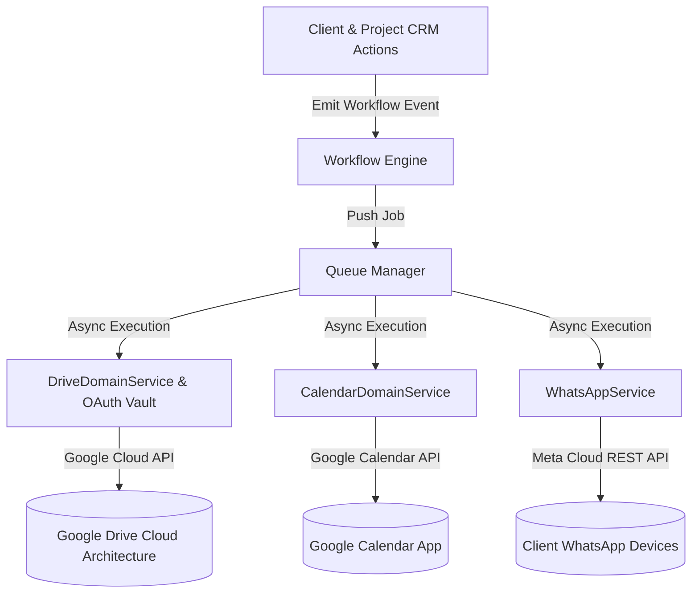

# RANDOM FRAMES OS — INTEGRATION ARCHITECTURE SPECIFICATION

**Document Version:** 1.0 (Permanently Frozen)  
**Classification:** Core Architectural Pillar  
**Status:** Certified & Locked

---

## 1. Purpose
This document specifies the centralized Integration Architecture connecting Random Frames OS with essential external ecosystem services: Google Drive (cloud document & footage storage), Google Calendar (production scheduling), WhatsApp (client communication), and Email (Web3Forms / automated notifications). It enforces strict OAuth token governance, multi-user file access security, and resilient background synchronization.

## 2. Responsibilities
* **Google Drive Integration (`DriveDomainService`):** Automates standardized hierarchical folder creation for converted Clients and Projects (`01_Admin`, `02_Pre_Production`, `03_Shoots`, `04_Post_Production_Editing`, `05_Client_Review`, `06_Final_Deliverables`). Protects the Founder Super Admin OAuth vault while granting multi-user concurrent editing access to agency creative staff.
* **Google Calendar Integration (`CalendarDomainService`):** Bridges operational Shoot schedules and team timetables directly with Google Calendar agendas, guaranteeing precise multi-user scheduling synchronization.
* **WhatsApp Integration (`WhatsAppService`):** Constructs formatted message payloads and dispatches transactional client reminders, quotation delivery alerts, and meeting notifications over Meta Cloud API.
* **Email & Webhook Integration:** Manages automated email transmission and inbound lead captures via verified Web3Forms hook handlers.

## 3. Architecture Diagram

## 4. Data Flow
1. **Event Origination:** A CRM event (e.g., converting a Lead or confirming a Shoot date) fires an automated workflow event over `WorkflowEngine`.
2. **Queue Offloading:** Specialized workflow handlers (`storage-handler`, `calendar-handler`, `whatsapp-handler`) intercept the event and offload payload parameters into `QueueManager`.
3. **OAuth Vault Authentication:** When the background worker executes a Google Drive or Calendar job, `DriveDomainService` retrieves encrypted OAuth access and refresh tokens exclusively owned by the **Founder Super Admin** account from secure storage.
4. **Multi-User Permission Governance:** Before creating shared folder links or calendar items, `DriveDomainService.verifyMultiUserFolderAccess()` verifies that creative collaborators (Editors, Photographers, Designers) gain authorized read/write permissions to their designated sub-folders without exposing root administrative vaults.
5. **API Dispatch & Resilience:** External network requests execute; network timeouts triggers automated exponential backoff retries without corrupting core CRM state.

## 5. Dependencies
* **Google Drive Core:** `frontend/domain/drive/service.ts` & `frontend/lib/drive/google-drive.ts`
* **Google Calendar Core:** `frontend/domain/calendar/service.ts` & `frontend/lib/calendar/*`
* **WhatsApp Core:** `frontend/domain/whatsapp/service.ts` & `frontend/lib/whatsapp/*`
* **Queue Integration:** `frontend/domain/integrations/*`

## 6. Extension Points
* **Adding New Integrations:** Future integrations (e.g., Xero/QuickBooks accounting or Frame.io video review) must be implemented as isolated adapters inside `/frontend/domain/integrations/<provider>/` and triggered strictly via `QueueManager.pushJob()`.
* **Custom Folder Archetypes:** Additional sub-folder nomenclature (e.g., `07_Archival_Raw_Media`) can be appended directly to constants in `DriveDomainService`.

## 7. Future Scalability
* **Unlimited Collaborator Scaling:** Verified through automated testing (`verifyMultiUserFolderAccess`), Drive folder tree access natively scales across dozens of editors and photographers concurrently without headcount restrictions.
* **Decoupled API Bottleneck Protection:** Relying on background queue ingestion ensures that peak agency operations (such as generating dozens of shoot folders simultaneously) never hit rate limit bottlenecks or crash server instances.

## 8. Developer Guidelines
* **Protect Founder OAuth Tokens:** Never expose, log, or transfer Google Drive OAuth credentials to operational user tiers (Co-Founder or employees). Root token management belongs strictly to the Founder Super Admin.
* **No Direct Client API Calls:** Never call Google Drive or WhatsApp cloud endpoints directly from frontend React code; all API executions must run over protected backend workers and queues.

## 9. Files Involved
* `frontend/domain/drive/service.ts`: Google Drive architecture, ownership governance, and collaborative access verification.
* `frontend/domain/calendar/service.ts`: Google Calendar production synchronization.
* `frontend/domain/whatsapp/service.ts`: WhatsApp Cloud API message payload construction and formatting.
* `frontend/domain/integrations/*`: Queue manager adapters and retry retry orchestrators.

## 10. Known Constraints
* **Token Refresh Lifecycle:** OAuth refresh tokens depend on continued authorization in GCP Console; expiration requires Founder re-authentication in Settings -> Integrations.
* **Meta WhatsApp Templates:** Outbound messages sent outside the 24-hour customer conversation window must strictly match verified Meta template signatures.

## 11. Things That Must Never Be Modified Without Architecture Review
1. **OAuth Vault Security Boundary:** Bypassing restrictions that prevent non-Founder staff from viewing or modifying Google integration OAuth keys is strictly prohibited.
2. **Synchronous API Execution Banning:** Replacing Queue Manager background execution with blocking, synchronous integration calls in UI server actions is banned.
3. **Multi-User Drive Governance:** Reverting folder access logic to assume a single editor or single photographer is forbidden.
