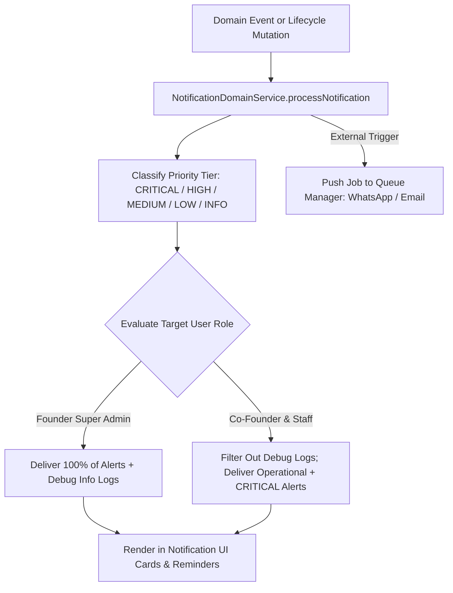

# RANDOM FRAMES OS — NOTIFICATION ARCHITECTURE SPECIFICATION

**Document Version:** 1.0 (Permanently Frozen)  
**Classification:** Core Architectural Pillar  
**Status:** Certified & Locked

---

## 1. Purpose
This document details the multi-tiered Notification Architecture governing communication, priority routing, operational role filtering, and automated message dispatch within Random Frames OS. It ensures relevant alerts reach executive and operational staff without information overload or system debugging chatter.

## 2. Responsibilities
* **Multi-Tiered Severity Classification:** Categorizes every alert into exact severity levels: `CRITICAL` (system failures, high-value financial events), `HIGH` (urgent client approvals, production date shifts), `MEDIUM` (standard deliverable reviews), `LOW` (minor administrative updates), and `INFO` (low-level developer and sync debugging logs).
* **Role-Aware Feed Routing:** Enforces intelligent filtering across organizational tiers:
  * **Founder (Super Admin):** Receives 100% of all notifications, including low-level system debugging errors and developer synchronization logs, guaranteeing complete executive observability.
  * **Co-Founder & Operational Staff:** Receives all operational client, shoot, and project notifications, PLUS all `CRITICAL` severity alerts across any domain, while cleanly filtering out developer-level system debugging chatter.
* **Multi-Channel Dispatch:** Coordinates internal CRM feed cards with external notification channels (WhatsApp messages via Meta Cloud and email reminders via Web3Forms/Queue workers).

## 3. Architecture Diagram

## 4. Data Flow
1. **Trigger Origination:** A domain action (e.g., `HIGH_VALUE_QUOTE` initiation by Co-Founder or an automated Google Calendar schedule sync error) calls `NotificationDomainService.dispatchNotification()`.
2. **Priority Tagging:** The engine evaluates payload metadata against constants in `frontend/domain/notifications/types.ts` and assigns a strict priority enum.
3. **Role Filtering:** When fetching active feeds for the user interface, `NotificationDomainService.getFilteredUserNotifications(userId, roleName)` is invoked. If `roleName === FOUNDER`, zero filtering occurs. If `roleName === CO_FOUNDER` or operational staff, keywords matching debug logs (`system sync debugging`, `stacktrace`) are stripped out unless priority equals `CRITICAL`.
4. **Asynchronous Dispatch:** For transactional communications, the service delegates payload data to `QueueManager`, which executes background HTTP calls to external WhatsApp or Email integration APIs.

## 5. Dependencies
* **Core Declarations:** `frontend/domain/notifications/types.ts`
* **Service Engine:** `frontend/domain/notifications/service.ts` (`NotificationDomainService`)
* **Asynchronous Execution:** `frontend/domain/integrations/queue-manager.ts`
* **Presentation UI:** `frontend/components/notifications/*` (Notification Cards, Reminder Modals).

## 6. Extension Points
* **New Priority Categories & Templates:** Custom email or WhatsApp notification templates can be appended to notification constant registries without refactoring delivery routing loops.
* **Web Push & Mobile SMS Integration:** Future external communication channels (such as native mobile push notifications or Twilio SMS) can be attached by registering new provider job handlers inside `QueueManager`.

## 7. Future Scalability
* **Unrestricted User Expansion:** Notification routing logic computes filter evaluations directly in stateless query abstractions, maintaining zero overhead as user headcount grows to 100+ concurrent staff sessions.
* **Granular Subscription Preference:** Future staff roles (e.g., Video Editors vs. Sales Executives) can utilize targeted domain tags (`production:*` vs. `finance:*`) directly within `NotificationDomainService` without redesigning database schemas.

## 8. Developer Guidelines
* **Do Not Spam Operational Staff:** Never emit low-level API retry exceptions or background token refresh logs with `CRITICAL` or `HIGH` priorities; reserve those exclusively for genuine system emergencies or high-value client actions.
* **Decoupled Notification Calls:** Never call WhatsApp or email REST endpoints directly inside interactive UI actions; always publish through `NotificationDomainService` and `QueueManager`.

## 9. Files Involved
* `frontend/domain/notifications/types.ts`: Enums and interface signatures for priority tiers and message models.
* `frontend/domain/notifications/service.ts`: Role-aware notification routing, priority resolution, and feed filtering.
* `frontend/domain/integrations/notification-manager.ts`: Bridges notifications with external retry queue workers.
* `frontend/components/notifications/*`: Interactive UI cards and status badge indicators.

## 10. Known Constraints
* **Client Polling / SSE Reliance:** Real-time updates in client browser views depend on SSE streams or active polling; disconnected clients sync their unread badge counts automatically upon reconnection.
* **External Provider Quotas:** WhatsApp Cloud API messaging depends on template pre-approvals and daily quota limits enforced by Meta.

## 11. Things That Must Never Be Modified Without Architecture Review
1. **Founder Full Observability:** Stripping debug logs, sync exceptions, or system errors out of the Founder Super Admin notification feed is strictly prohibited.
2. **Critical Override Guarantee:** Co-Founder and executive managers must never be blocked from receiving `CRITICAL` severity notifications, regardless of which operational domain originated the alert.
3. **Asynchronous Delegation:** Executing blocking network calls to external notification providers directly within synchronous UI database transactions is forbidden.
