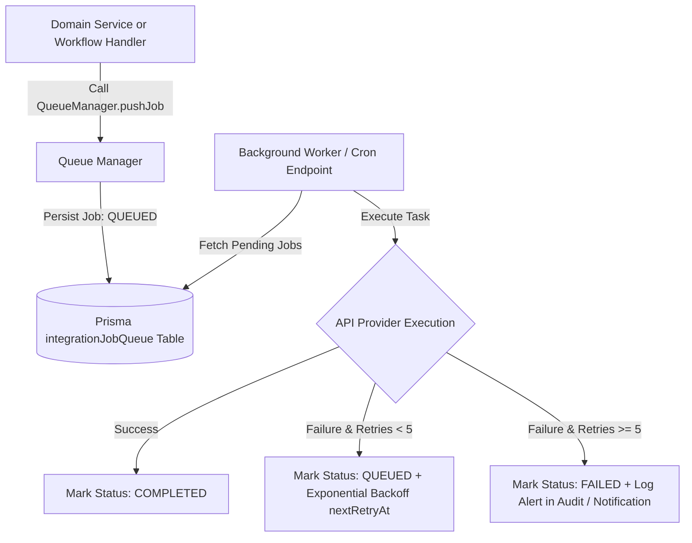

# RANDOM FRAMES OS — QUEUE ARCHITECTURE SPECIFICATION

**Document Version:** 1.0 (Permanently Frozen)  
**Classification:** Core Architectural Pillar  
**Status:** Certified & Locked

---

## 1. Purpose
This document specifies the asynchronous Queue Architecture governed by `QueueManager`. The queue provides reliable background job execution, automated exponential backoff retries, and failure containment, ensuring third-party API network disruptions never cause CRM failures in Random Frames OS.

## 2. Responsibilities
* **Asynchronous Execution:** Offloads slow third-party API interactions (such as Google Drive folder creation, Google Calendar synchronization, and WhatsApp message dispatch) from synchronous user UI request threads.
* **Resilient Retry & Backoff:** Implements automatic exponential backoff scheduling (`nextRetryAt = Date.now() + 2^retryCount * 60000`) for up to 5 maximum retry iterations before marking a job exhausted.
* **Failure Containment:** GUARANTEES that CRM operations never fail due to integration outages. If an external API is offline or rate-limited, the local database mutation completes successfully while the background queue absorbs and retries the sync task.
* **Universal Job Support & Future Readiness:** Supports dynamic provider and action string configurations, natively handling both current integrations and advanced future tasks without architectural alterations.

## 3. Architecture Diagram

## 4. Data Flow
1. **Job Ingestion:** During a workflow event (e.g., `CREATE_CLIENT_FOLDERS`), code invokes `QueueManager.pushJob('GOOGLE_DRIVE', 'CREATE_CLIENT_FOLDERS', payload)`.
2. **Persistence:** The manager writes an atomic record into the database table `IntegrationJobQueue` with status `QUEUED`, zero retries, and an initial execution schedule timestamp.
3. **Worker Harvesting:** A scheduled cron job or background worker process periodically hits `/api/cron/process-queue` to harvest all jobs where `status == 'QUEUED'` and `nextRetryAt <= now()`.
4. **Execution & Lifecycle Updates:** The worker invokes the specific provider adapter. Upon successful resolution, `QueueManager.markJobCompleted(jobId)` updates the record. On unexpected exceptions, `QueueManager.markJobFailed(jobId, errorMsg, currentRetryCount)` applies exponential backoff scheduling.

## 5. Dependencies
* **Queue Engine:** `frontend/domain/integrations/queue-manager.ts`
* **Retry Wrapper:** `frontend/domain/integrations/retry-manager.ts`
* **Database Table:** `IntegrationJobQueue` model in `frontend/prisma/schema.prisma`
* **Worker Endpoint:** `frontend/app/api/cron/process-queue/route.ts`

## 6. Extension Points & Supported Jobs
* **Current Jobs:** Natively configured and certified for:
  * `GOOGLE_DRIVE`: Folder hierarchy generation and permissions sync.
  * `GOOGLE_CALENDAR`: Production agenda and timetable insertions.
  * `WHATSAPP`: Transactional notification template dispatch.
  * `EMAIL`: Quotation and invoice PDF delivery.
  * `NOTIFICATIONS`: Background alert queue routing.
* **Future-Ready Jobs (Ready without modification):** Because `provider` and `action` parameters are typed as dynamic strings, future modules can push jobs for:
  * `Presence Updates` & `Realtime Broadcast` synchronization.
  * `Conflict Resolution` logging.
  * `Timeline Sync` & `Audit Sync` replication.
  * `Version History` pruning and archival.
  * `AI Background Tasks` (e.g., automated image curation, metadata generation).

## 7. Future Scalability
* **100+ Concurrent User Load:** As user headcount scales to 100+ active staff generating thousands of operational updates daily, background job queues buffer burst spikes cleanly, preserving sub-100ms response times across interactive UI screens.
* **Distributed Queue Readiness:** The simple static abstraction in `QueueManager` allows enterprise deployments to swap PostgreSQL tables for dedicated BullMQ, Redis, or AWS SQS worker pools without modifying calling Domain Services.

## 8. Developer Guidelines
* **Never Block CRM Mutations:** Do not insert synchronous `await fetch("https://googleapis.com/...")` calls inside interactive server actions; always push tasks into `QueueManager`.
* **Idempotent Job Payloads:** Payloads passed to `pushJob` must include unique target entity IDs (e.g., `clientId`, `projectId`) so repeated attempts safely verify whether target resources already exist before recreating them.

## 9. Files Involved
* `frontend/domain/integrations/queue-manager.ts`: Core queue persistence and retry state computation.
* `frontend/domain/integrations/retry-manager.ts`: Automated retry wrapper utilities.
* `frontend/app/api/cron/process-queue/route.ts`: API route executing background worker harvesting loops.
* `frontend/prisma/schema.prisma`: Data definition for `IntegrationJobQueue`.

## 10. Known Constraints
* **Worker Execution Interval:** In environments without running daemons, queue harvesting relies on periodic Vercel Cron or external scheduler pings; tasks execute at the next scheduled trigger window.
* **Maximum Retention:** Completed and exhausted jobs accumulate in `IntegrationJobQueue` and should be periodically archived by database maintenance cleanup tasks.

## 11. Things That Must Never Be Modified Without Architecture Review
1. **CRM Fail-Safe Guarantee:** Removing queue wrapping from integration handlers to force synchronous third-party API execution in user transactions is strictly prohibited.
2. **Exponential Backoff Logic:** Removing exponential delays to spam failing third-party endpoints (risking permanent API bans) is forbidden.
3. **Dynamic Provider Acceptance:** Restricting `QueueManager.pushJob` to arbitrary rigid enum literals that prevent future AI or background tasks from being queued is banned.
