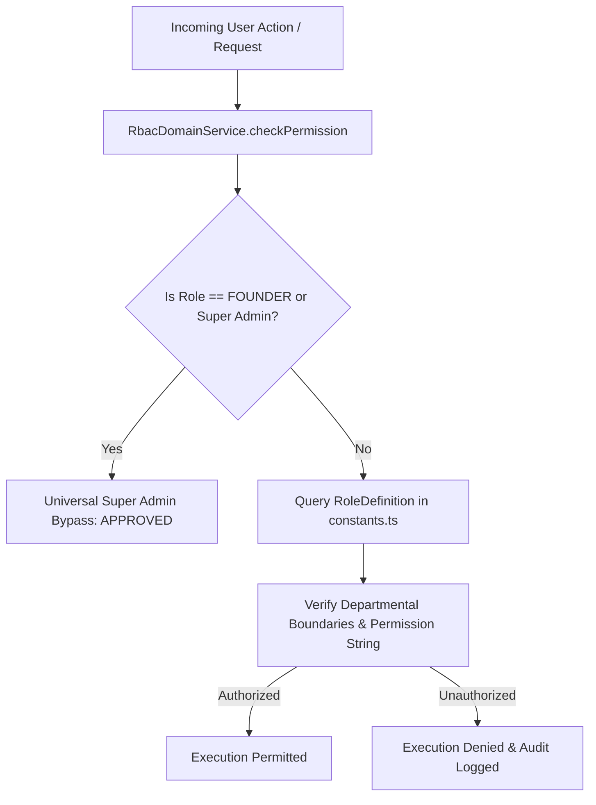

# RANDOM FRAMES OS — RBAC (ROLE-BASED ACCESS CONTROL) ARCHITECTURE SPECIFICATION

**Document Version:** 1.0 (Permanently Frozen)  
**Classification:** Core Architectural Pillar  
**Status:** Certified & Locked

---

## 1. Purpose
This document specifies the centralized Role-Based Access Control (RBAC) architecture governing authentication, multi-tiered authorization, organizational department mapping, UI visibility toggles, and concurrent session capacity across Random Frames OS.

## 2. Responsibilities
* **Enterprise Roster Governance:** Maintains definitions for all 16 native enterprise roles across executive management, creative production, sales, and finance operations.
* **Super Admin Universal Bypass:** Guarantees that the **Founder** account receives instantaneous authorization across 100% of actions and system domains without querying granular permission matrices.
* **Departmental Isolation:** Enforces operational barriers (e.g., preventing Co-Founder or Operations staff from modifying administrative security parameters or viewing Founder OAuth integration vaults).
* **UI Visibility Control (`isUiVisible`):** Isolates Version 1 UI exposure solely to active roles (`Founder`, `Co-Founder`, `Owner`) while completely concealing all future employee roles in presentation views until enabled later.
* **Concurrent Session Resolution:** Validates that concurrent authenticated sessions scale boundlessly (`UNLIMITED`) without architectural bottlenecks.

## 3. Architecture Diagram

## 4. Data Flow
1. **Authentication:** The user signs in via OAuth or local bcrypt credential evaluation; session tokens encode `userId`, `roleName`, and `department`.
2. **Action Interception:** Before executing a Server Action or Database query, code calls `RbacDomainService.checkPermission(roleName, requiredAction)`.
3. **Bypass Evaluation:** If `roleName === RoleName.FOUNDER` or legacy `Super Admin`, an immediate authorization boolean (`true`) is returned without further computation.
4. **Granular Matrix Lookup:** For all other roles (e.g., `Co-Founder`, `Editor`, `Finance Executive`), the service queries configured permissions in `constants.ts`. If the requested operational string matches allowed domains, execution continues; otherwise, an access rejection is returned.

## 5. Dependencies
* **Core Declarations:** `frontend/domain/rbac/types.ts` & `frontend/domain/rbac/constants.ts`
* **Execution Service:** `frontend/domain/rbac/service.ts` (`RbacDomainService`)
* **Consumer Modules:** Server Actions (`app/actions/*`), API routes, and Domain Services.

## 6. Extension Points
* **Activating Future Roles in UI:** To expose an existing enterprise role in UI dropdowns or user management tables during agency scaling, toggle `isUiVisible` from `false` to `true` in `constants.ts` (subject to Change Management Review).
* **Adding New Operational Permissions:** New action string identifiers (e.g., `inventory.manage`) may be appended to existing role permission arrays without breaking existing permission checks.

## 7. Future Scalability
* **100+ User Scale:** The authorization resolution operates in memory via high-speed lookups and static configuration caching, guaranteeing 0ms latency degradation as active concurrent user headcount scales from 2 to 100+.
* **Pre-Built Roster:** The architecture natively incorporates `Graphic Designer`, `Content Writer`, `Social Media Manager`, `Business Development`, `Finance Executive`, `Operations Manager`, and `Intern` roles, completely future-proofing agency expansion without refactoring RBAC mechanics.

## 8. Developer Guidelines
* **Never Hardcode User IDs:** Do not write checks like `if (userId === 'usr_xyz')` in operational code; always evaluate access against explicit roles and permission strings via `RbacDomainService`.
* **Protect Founder Credentials:** The Founder account currently in production remains the permanent Super Admin account; never recreate, modify, or attempt password resets on this identity.

## 9. Files Involved
* `frontend/domain/rbac/types.ts`: Defines `RoleName` enum, `Department`, and `RoleDefinition` interface.
* `frontend/domain/rbac/constants.ts`: Complete table of all 16 roles, permissions, and `isUiVisible` states.
* `frontend/domain/rbac/service.ts`: Exposes `checkPermission`, `getUiVisibleRoles`, `validateConcurrentSession`, and Google Drive access boundaries.
* `frontend/domain/approvals/*`: Matrix enforcing when actions (e.g., discount overrides by Co-Founder) trigger mandatory Founder approval workflows.

## 10. Known Constraints
* **Immutable Bypass:** The universal bypass assigned to Founder cannot be programmatically suppressed or limited by client requests.
* **UI Concealment Enforcement:** UI dropdown components must invoke `RbacDomainService.getUiVisibleRoles()` rather than mapping over raw enum arrays to ensure hidden enterprise roles remain fully concealed in Version 1.

## 11. Things That Must Never Be Modified Without Architecture Review
1. **Founder Super Admin Universal Bypass:** Must remain permanently intact.
2. **Version 1 UI Concealment:** Toggling `isUiVisible: true` for future roles without formal agency headcount expansion approval is prohibited.
3. **Departmental Access Controls:** Co-Founder and employee roles must never be granted direct administrative access to system security, user management, or OAuth token integration configuration vaults.
