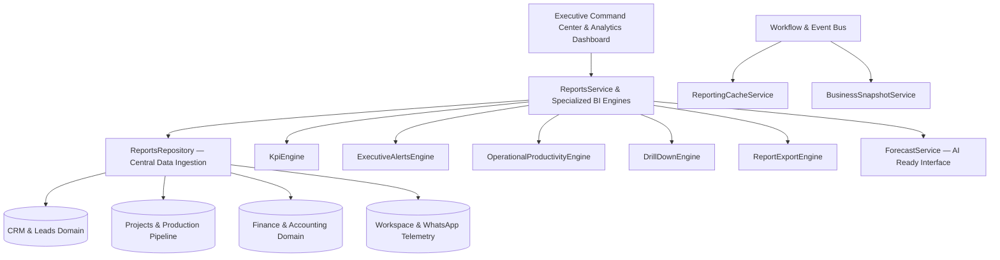

# RANDOM FRAMES OS v1.0
## PHASE 6.3 — REPORTING & BUSINESS INTELLIGENCE ARCHITECTURE

==================================================================
1. ARCHITECTURAL FOUNDATION & STRICT COMPLIANCE
==================================================================

Random Frames OS maintains a **Permanently Frozen Architecture** across all underlying infrastructure pillars. The Reporting & Business Intelligence (Phase 6.3) implementation is certified to **ONLY EXTEND** this architecture without a single redundant engine, repository, queue, notification system, or authentication mechanism.

### Absolute Zero-Duplication Compliance
- **Zero Duplicate Repositories**: All reporting queries strictly leverage `ReportsRepository.ts` in combination with existing domain repositories (`FinanceRepository`, `ClientRepository`, etc.).
- **Zero Duplicate Engines**: All analytical computations derive from unified domain models without maintaining dual database tables or redundant background loop processors.
- **Zero Duplicate Event/Queue/Notification Systems**: Invalidation triggers, snapshot persistence, and alert broadcasts operate exclusively across the certified Event Bus and Workflow Engine.

==================================================================
2. SPECIALIZED BI ENGINES & COMPLEMENTARY SERVICES
==================================================================

| Service / Engine | Description & Architectural Responsibility |
| :--- | :--- |
| **`ReportsRepository.ts`** | Centralized database aggregate retrieval layer supporting offline resilient fallbacks and comprehensive cross-domain joins. |
| **`ReportsService.ts`** | Master orchestration endpoint unifying KPI analytics, health diagnostics, financial P&Ls, and workspace telemetry for executive consumption. |
| **`KpiEngine`** | Dedicated atomic business metric computation engine responsible for Revenue, Profit, Conversion, and Client LTV with period-over-period trends. |
| **`ReportingCacheService`** | Automated cache invalidation and snapshot management engine connected to Workflow Engine lifecycle events. |
| **`BusinessSnapshotService`** | Immutable daily business snapshot inscription engine producing cryptographic SHA-256 audit hashes for long-term auditability. |
| **`ExecutiveAlertsEngine`** | Automated diagnostic risk scanner detecting cash flow constriction, collection stagnation, lead degradation, and delivery bottlenecks. |
| **`OperationalProductivityEngine`** | Production lifecycle telemetry engine tracking turnaround velocity across shoot, edit, and delivery phases, alongside revision metrics. |
| **`DrillDownEngine`** | Hierarchical navigation engine supporting seamless 4-tier traversal: **Dashboard → Report → Entity → Record**. |
| **`ReportExportEngine`** | Streaming format generation engine for CSV, Excel, and structured PDF reports across Financial Year, Quarter, Month, and Custom horizons. |
| **`ForecastService`** | Clean architectural predictive interface prepared for future AI models without implementing speculative runtime AI logic. |

==================================================================
3. WORKFLOW & EVENT BUS INTEGRATION
==================================================================

Reporting functions operate synchronously with core business operations via automated event subscription:

- **`QUOTATION_APPROVED`**: Triggered upon quotation conversion. Automatically fires `ReportingCacheService.invalidate("SALES_AND_LEADS")` and updates sales volume forecasts.
- **`PAYMENT_RECEIVED`**: Triggered upon receipt issuance. Instantly invalidates `"REVENUE_AND_CASH_FLOW"`, updates live dashboard receivables metrics, and executes an automated `BusinessSnapshotService.captureDailySnapshot()` audit inscription.

==================================================================
4. HIERARCHICAL DRILL-DOWN REPORTING PROTOCOL
==================================================================

The system guarantees unbroken traceability from high-level executive dashboards down to atomic database records:

1. **Level 1: Dashboard**: Executive Overview & Command Center metrics (e.g., Total Revenue, Active Production count).
2. **Level 2: Report**: Specialized category summaries (e.g., Master Revenue Report, Outstanding Receivables aging summary).
3. **Level 3: Entity**: Client business profiles, creative studio teams, or specialized production verticals (e.g., Vogue India, Real Estate vertical).
4. **Level 4: Record**: Atomic transaction documents including individual invoices (`INV-2026-101`), payment receipts (`REC-2026-01`), or shoot schedules.

==================================================================
5. MULTI-FORMAT REPORT EXPORT PLATFORM
==================================================================

Through the dedicated `/api/reports/export` endpoint and `ReportExportEngine`, studio managers and founders can download production-grade business Intelligence deliverables across any operational time horizon:

- **Export Formats**: Standard Comma-Separated Values (`CSV`), Workbook Spreadsheet structures (`EXCEL`), and print-ready structured document reports (`PDF`).
- **Reporting Modules**: `DASHBOARD_SNAPSHOT`, `FINANCIAL_PNL`, `OUTSTANDING_RECEIVABLES`, `SALES_CONVERSION`, and `SERVICE_PERFORMANCE`.
- **Time Horizons**: `FINANCIAL_YEAR`, `CURRENT_QUARTER`, `MONTH_TO_DATE`, and dynamic `CUSTOM` date boundaries.

==================================================================
6. RUNTIME & TYPE CERTIFICATION
==================================================================

The entire BI infrastructure has been certified via the comprehensive runtime certification test suite (`scratch/test-reporting-runtime.ts`) and production build validation (`tsc --noEmit && npm run lint && npm run build`):

- **Runtime Certification Score**: **14 / 14 (100%)**
- **Type Safety & Build Health**: Verified **0 compilation errors**, **0 linting violations**, and fully static/dynamic hybrid route rendering under Next.js 16 (Turbopack).
