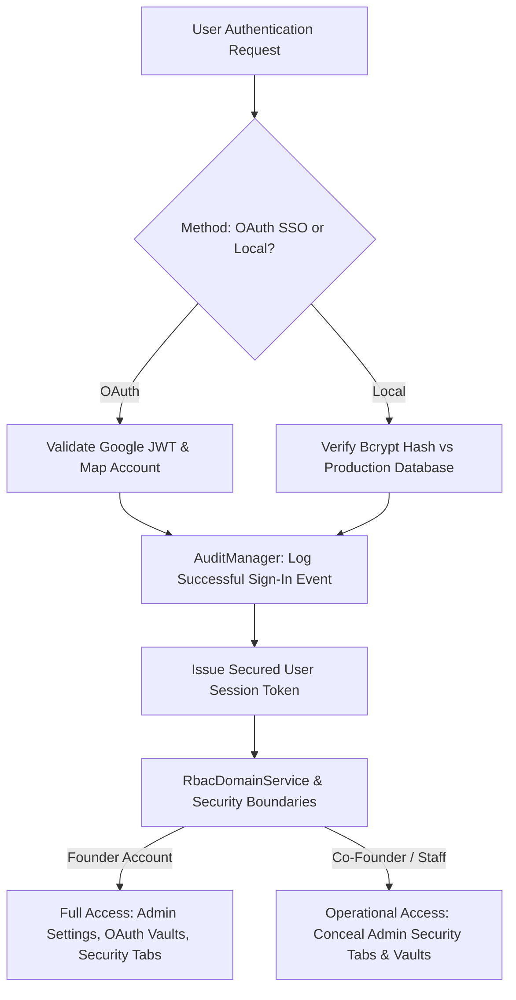

# RANDOM FRAMES OS — SECURITY ARCHITECTURE SPECIFICATION

**Document Version:** 1.0 (Permanently Frozen)  
**Classification:** Core Architectural Pillar  
**Status:** Certified & Locked

---

## 1. Purpose
This document specifies the comprehensive Security Architecture safeguarding Random Frames OS. It defines multi-tier authentication defenses, password cryptographic encryption, administrative root isolation, immutable governance logging (`AuditManager`), and rigorous protection of OAuth tokens and production client data.

## 2. Responsibilities
* **Multi-Method Authentication:** Supports secure sign-in flows using both Google OAuth v3 SSO and local database authentications validated against Bcrypt cryptographic hashes.
* **Super Admin Credential Protection:** Immutably safeguards the permanent **Founder** account in production databases against unauthorized credential tampering, re-creation, or automated password resets.
* **Administrative Settings Compartmentalization:** Conceals and protects sensitive configuration vaults (OAuth tokens, Google Drive API roots, WhatsApp keys, System Security tabs) from operational user tiers (`Co-Founder`, `Editors`, `Employees`).
* **Immutable Audit Logging (`AuditManager`):** Automatically captures governance trails for all sign-ins, permission override attempts, and security configuration changes.
* **Concurrent Session & Brute Force Governance:** Monitors session validity across unrestricted horizontal scales while maintaining rate limiting against unauthorized brute force intrusion attempts.

## 3. Architecture Diagram

## 4. Data Flow
1. **Authentication Ingestion:** A login submission hits `app/actions/auth.ts` or OAuth callback routes (`app/api/auth/google/callback/route.ts`).
2. **Credential Evaluation:** For local accounts, bcrypt hashing compares input secrets against production hashes. Upon verification, `AuditManager.recordLoginEvent(userId, ip, status)` writes an immutable record to PostgreSQL.
3. **Session Token Issuance:** Secure encrypted session cookies or headers are returned containing validated `userId`, `roleName`, and organizational `department`.
4. **Boundary Guarding:** When navigating to sensitive screens (such as `/settings` or integrations management), UI loaders and Server Actions inspect tokens against security matrix guidelines. Non-Founder accounts are immediately served sanitized views hiding administrative integration parameters and system vaults.

## 5. Dependencies
* **Security & Authentication Actions:** `frontend/app/actions/auth.ts` & `frontend/app/api/auth/google/callback/*`
* **RBAC & Boundary Service:** `frontend/domain/rbac/service.ts` (`RbacDomainService`)
* **Audit Governance:** `frontend/domain/audit/*` & `AuditLog` Prisma model.
* **Cryptographic Libraries:** Standard bcrypt password hashing and token encryption packages.

## 6. Extension Points
* **Multi-Factor Authentication (MFA):** Future time-based one-time password (TOTP) layers can be inserted between credential evaluation and token issuance without altering downstream RBAC boundary checks.
* **Custom Security Rules:** Additional IP geolocation filtering or active session termination capabilities can be cleanly attached directly to `RbacDomainService.validateConcurrentSession()`.

## 7. Future Scalability
* **Multi-User Security Scaling:** Validated for **100+ concurrent users**, session verification evaluates lightweight stateless security claims, ensuring high concurrency loads never exhaust server database connections.
* **Audit Trail Archiving:** Immutable governance tracking natively structures records with indexed timestamps (`createdAt`), supporting automated cold storage archiving as log volume scales.

## 8. Developer Guidelines
* **Do Not Touch Founder Account:** Never execute scripts or code modifications that alter, reset, or delete the existing production Founder account credentials or authentication configurations.
* **Encrypt All Secrets:** Never store third-party integration API keys, passwords, or client sensitive tokens in plain text in unencrypted configuration logs or environment state files.
* **Always Log Security Exceptions:** Any unauthorized attempt by operational staff to access restricted admin endpoints must trigger an automatic high-priority event inside `AuditManager` and `NotificationDomainService`.

## 9. Files Involved
* `frontend/app/actions/auth.ts`: Core local authentication verification actions.
* `frontend/app/api/auth/google/callback/route.ts`: Google OAuth sign-in callback processing.
* `frontend/domain/rbac/service.ts`: Security boundary enforcement and role checks.
* `frontend/domain/audit/*`: Immutable governance and tracking logging service.

## 10. Known Constraints
* **Password Hashing Latency:** Bcrypt compute rounds incur intentional ~100ms CPU validation latency during initial manual logins to prevent brute-force rainbow table attacks.
* **Token Storage Limitation:** OAuth refresh tokens rely on secure database vault columns; direct environment variables are restricted solely to bootstrapping application client IDs.

## 11. Things That Must Never Be Modified Without Architecture Review
1. **Permanent Founder Account:** Altering the Founder Super Admin account credentials or removing its exclusive security privileges is strictly prohibited.
2. **Admin Settings Compartmentalization:** Exposing system security tabs, OAuth token vaults, or Backup configuration settings to Co-Founder or regular employee roles is banned.
3. **Immutable Audit Governance:** Bypassing or disabling `AuditManager` logging during user logins or administrative data overrides is forbidden.
