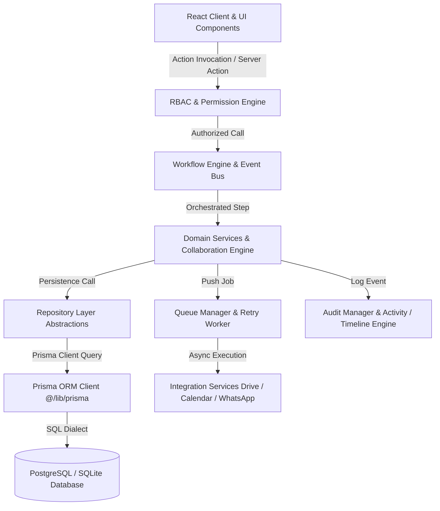

# RANDOM FRAMES OS — SYSTEM ARCHITECTURE SPECIFICATION

**Document Version:** 1.0 (Permanently Frozen)  
**Classification:** Core Architectural Pillar  
**Status:** Certified & Locked

---

## 1. Purpose
The purpose of Random Frames OS is to provide a unified, multi-user business operating system tailored for high-end creative photography and filmmaking agencies. This document defines the comprehensive layered architecture that guarantees deterministic runtime behaviors, seamless horizontal user scaling (from 2 users up to 100+ concurrent users), and zero coupling between UI screens and underlying database engines.

## 2. Responsibilities
The System Architecture enforces strict responsibilities across distinct operational strata:
* **UI & Client Render:** Responsible exclusively for presentation, responsive interaction, and rendering personalized tokens based on role authorization.
* **Security & RBAC Enforcement:** Validates sessions, enforces fine-grained permission checks, applies the universal Founder bypass, and manages UI role visibility.
* **Workflow Orchestration:** Listens to event mutations via the Event Bus and drives automated pipeline handoffs across CRM, Production, and Billing stages.
* **Domain Business Logic:** Encapsulates 100% of domain enterprise rules across Leads, Clients, Projects, Shoots, Deliverables, Collaboration, and Finance.
* **Repository Persistence:** Abstracts underlying database dialects and Prisma schema queries from domain services and UI components.
* **Asynchronous Integration Queue:** Executes integration syncs (Google Drive, Calendar, WhatsApp) via retry-resilient background workers.
* **Governance Tracking (Audit, Activity, Timeline):** Immutably logs login governance, pipeline transitions, and lifecycle milestones.

## 3. Architecture Diagram

## 4. Data Flow
1. **Initiation:** A user performs an action in the UI (e.g., creating a lead or updating a deliverable status).
2. **Authorization:** The Server Action or API route invokes `RbacDomainService.checkPermission()`. If the user is `Founder`, a Super Admin universal bypass is granted. If unauthorized, an error is returned before any business execution.
3. **Orchestration:** The request passes into the relevant Workflow Handler (`LeadHandler`, `ProjectHandler`, `ShootHandler`, etc.), which emits domain lifecycle events over the Event Bus.
4. **Domain Execution & Concurrency Protection:** The Workflow invokes the Domain Service (e.g., `DeliverableService`, `OptimisticConcurrencyEngine`). If a simultaneous modification occurs, row versions are verified, and an `OptimisticLockError` is thrown to prevent silent data overwrites.
5. **Persistence:** The Domain Service calls Repository abstracts (`ProjectRepository`, `LeadRepository`), which execute pure database queries via `@/lib/prisma`.
6. **Side Effects & Governance:** As a result of domain completion, asynchronous tasks are queued to `QueueManager` for third-party syncs, while `AuditManager`, `ActivityService`, and `TimelineManager` asynchronously commit governance trails without blocking user response times.

## 5. Dependencies
* **Framework:** Next.js (App Router, Server Actions, API Routes).
* **Language & Runtime:** TypeScript, Node.js (Zsh / macOS Server Environment).
* **Database & ORM:** Prisma Client (`@prisma/client`) interfacing with relational SQL datastores.
* **External Providers:** Google Cloud Platform (Drive & Calendar OAuth v3), Meta WhatsApp Cloud API, Web3Forms.

## 6. Extension Points
* **New Business Modules (HR, Inventory, Client Portal):** Must be introduced as specialized folders inside `/frontend/domain/<module>/` implementing custom Domain Services and Repositories.
* **Workflow Automation Hooks:** Extendable by registering brand-new event listeners directly in `WorkflowEngine.registerHandler()` without overriding existing handlers.
* **Asynchronous Jobs:** Extendable via `QueueManager.pushJob(provider, action, payload)` to support future real-time presence syncs, AI processing workers, and media renders.

## 7. Future Scalability
The architecture completely avoids single-user or dual-user hardcoding:
* **Concurrent Capacity:** Certified for **100+ concurrent staff sessions** (Editors, Photographers, Videographers, Sales, Finance, Designers).
* **State Management:** Live presence tracking (`LivePresenceService`) and real-time streaming adapters (`RealtimeBroadcastAdapter`) natively scale across WebSockets and Server-Sent Events (SSE).
* **UI Concealment:** Through the `isUiVisible` configuration parameter, enterprise roles remain hidden in Version 1 while instantly activatable in future multi-branch deployments without code rewrites.

## 8. Developer Guidelines
* **Strict Layering:** Never skip layers. Never call Prisma directly from React components or bare server actions.
* **Error Containment:** All CRM operational workflows must be fail-safe. Third-party network failures must fall back to background queue retries rather than throwing 500 fatal exceptions to the user UI.
* **Optimistic Concurrency:** When editing shared deliverables or financial records, always pass expected version numbers to `OptimisticConcurrencyEngine.validateMutation()` before committing changes.

## 9. Files Involved
* `frontend/app/(dashboard)/*` & `frontend/components/*`: Presentation Layer.
* `frontend/domain/rbac/service.ts`: Security & Access Authorization.
* `frontend/lib/workflow/*`: Workflow Automation & Event Bus.
* `frontend/domain/services/*` & `frontend/domain/collaboration/*`: Core Domain logic.
* `frontend/domain/repositories/*` & `frontend/lib/prisma.ts`: Data Persistence.
* `frontend/domain/integrations/*`: Queue and Integration Handlers.

## 10. Known Constraints
* **Token Security:** OAuth tokens belonging to the Founder (Super Admin) must never be shared, logged, or surfaced to operational user tiers (Co-Founder or employees).
* **Offline Resilience:** Integration workers assume intermittent API disruptions and rely on exponential backoff inside `QueueManager`.
* **Database Monolith:** The system runs on a central transactional datastore; read-replica scaling requires repository-level connection pooling configuration.

## 11. Things That Must Never Be Modified Without Architecture Review
1. **The 11 Permanent Pillars:** RBAC, Workflow Engine, Notification Engine, Queue Manager, Repository Layer, Domain Services, Collaboration Domain, Audit Manager, Activity Manager, Timeline Manager, Integration Services.
2. **Founder Super Admin Universal Bypass:** Must never be removed or conditioned on arbitrary permission flags.
3. **Layer Isolation:** Introducing direct Prisma calls inside React UI components or dumping raw domain execution into Server Actions is strictly prohibited.
4. **Optimistic Locking Guardrails:** Bypassing row versioning checks during collaborative deliverable mutations is forbidden.
