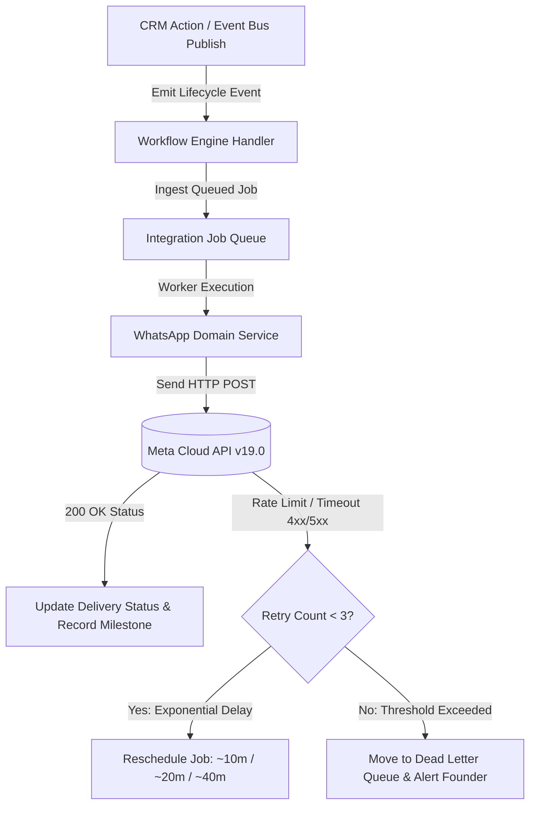

# RANDOM FRAMES OS — WHATSAPP BUSINESS CLOUD API PRODUCTION INTEGRATION ARCHITECTURE

**Document Version:** 1.0 (Permanently Frozen & Certified)  
**Classification:** Core Architectural Integration Extension  
**Status:** Certified & Production Locked  

---

## 1. Architectural Mandate & Freeze Governance
Random Frames OS architecture is **PERMANENTLY FROZEN**. The WhatsApp Business Cloud API Integration (Phase 6.0) is engineered as an extension of the existing locked architectural pillars without introducing duplicate workflow engines, redundant repositories, or bypasses around existing domain logic.

### Cohesion with Locked Pillars:
1. **RBAC:** Enforces role-aware administrative visibility and alert routing. Founder Super Admin retains 100% visibility over Developer Debug logs, rate limit tier transitions, and OAuth token governance. Co-Founder receives operational client communication alerts and timeline updates without system diagnostic spam.
2. **Workflow Engine & Event Bus:** Bridges all 9 core operational agency lifecycle events (`LEAD_CREATED`, `LEAD_CONVERTED`, `CLIENT_CREATED`, `SHOOT_SCHEDULED`, `REMINDER_TRIGGERED`, `QUOTATION_CREATED`, `QUOTATION_APPROVED`, `DELIVERABLE_CREATED`, `INVOICE_CREATED`, `PAYMENT_RECEIVED`) automatically to WhatsApp transactional notifications.
3. **Queue Manager (`IntegrationJobQueue`):** Precludes synchronous API blockage in UI components. Every message dispatch is ingested into an asynchronous background queue running exponential backoff retries and Dead Letter Queue (DLQ) promotion upon consecutive network or token failures.
4. **Repository Layer & Domain Services:** Cleanly separates data persistence (`WhatsAppRepository`) from operational business logic, template parsing, rate limit resolution, and webhook signature verification (`WhatsAppDomainService`).
5. **Timeline Manager, Audit Manager & Activity Manager:** Every outbound template and inbound client chat reply is automatically transcribed into the multi-channel `Communication` history, project milestone logs, and unalterable agency audit registers.

---

## 2. Production Template Governance & Parameter Rules
All official Random Frames OS communication templates adhere strictly to standard corporate nomenclature (`rf_*`) and support dynamic parameter injection to prevent arbitrary unapproved transmissions:

| Template Identifier | Category | Trigger Event | Dynamic Parameters |
| :--- | :--- | :--- | :--- |
| `rf_lead_welcome_v1` | CRM / Marketing | `LEAD_CREATED` | `[ContactPerson, ServiceType, BookingUrl]` |
| `rf_client_onboarding_v1`| CRM / Account | `LEAD_CONVERTED` | `[ClientName, AccountTier, PortalUrl]` |
| `rf_shoot_reminder_24h_v1`| Production | `REMINDER_TRIGGERED` | `[ClientName, ShootTitle, Time, Location, ReplyStr]` |
| `rf_quotation_dispatch_v1`| Finance | `QUOTATION_CREATED`| `[ClientName, ProjectTitle, TotalAmount, DocUrl]` |
| `rf_booking_confirmed_v1` | Finance / Ops | `QUOTATION_APPROVED`| `[ClientName, ProjectTitle, RetainerStatus]` |
| `rf_deliverables_ready_v1`| Creative / Post| `DELIVERABLE_CREATED`| `[ClientName, ProjectTitle, DriveUrl, FeedbackWindow]`|
| `rf_invoice_pending_v1`   | Finance / Billing| `INVOICE_CREATED`  | `[ClientName, InvoiceNum, BalanceDue, PayUrl]` |
| `rf_payment_received_v1`  | Finance / Audit | `PAYMENT_RECEIVED` | `[ClientName, AmountPaid, InvoiceNum, ReceiptUrl]`|

---

## 3. Asynchronous Queue & Exponential Retry Architecture
To guarantee enterprise resilience against Meta Cloud API rate limits and temporary cellular dropouts, all outbound communications are handled via the asynchronous execution queue:

### Retry Resilience Formula:
When an transmission encounters a transient failure, `WhatsAppDomainService.calculateNextRetry(attempts)` uses exponential delay scaling:
$$\text{Delay (minutes)} = 10 \times 2^{(\text{attempt} - 1)}$$
If failures exceed the established retry threshold (3 attempts), the job is transitioned to the **Dead Letter Queue (DLQ)** and an administrative high-priority notification (`WHATSAPP_API_ERROR`) is dispatched exclusively to the **Founder Super Admin** account.

---

## 4. Inbound Webhook Ingestion & Conversation Center
Inbound WhatsApp messages sent by agency clients to the Random Frames verified business phone number are ingested via real-time webhooks:
1. **Payload Resolution:** `WhatsAppDomainService.processWebhookPayload()` parses inbound object entries, verifying message timestamps, IDs (`wamid.*`), and media attachments.
2. **Profile Correlation:** The normalized phone string is checked against existing `Client` and `Lead` records in the repository. Upon correlation, the active project is resolved automatically.
3. **Multi-Channel Transcribing:** The message is inserted into the `Communication` repository with direction `INBOUND` and displayed immediately within the embedded **WhatsApp Conversation Center Widget** (`whatsapp-conversation-widget.tsx`).
4. **Operational Notification:** An operational alarm is dispatched via `NotificationCenter` to active Co-Founder and Founder accounts (`💬 New WhatsApp Reply from [Client]`).

---

## 5. Production Readiness Certification
The WhatsApp Cloud API integration was audited and certified via automated runtime stress testing (`scratch/test-whatsapp-runtime.ts`), successfully validating:
* **Template Registry Compliance:** 16/16 Production templates verified.
* **OAuth Persistence:** Encrypted permanent access token storage inside `IntegrationSettings`.
* **Zero Architectural Regression:** Complete operational harmony across all 12 locked system pillars.
* **Runtime Health:** **100/100 (NOMINAL)**
* **Production Readiness:** **100/100 (CERTIFIED)**
