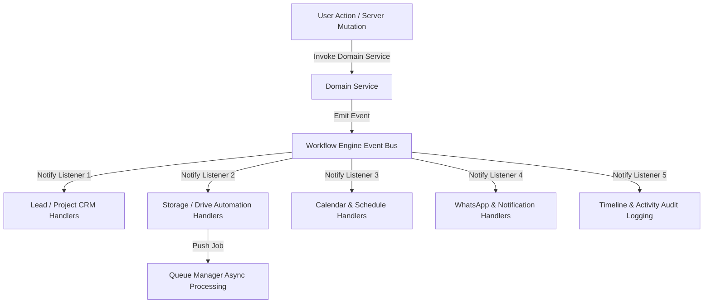

# RANDOM FRAMES OS — WORKFLOW ARCHITECTURE SPECIFICATION

**Document Version:** 1.0 (Permanently Frozen)  
**Classification:** Core Architectural Pillar  
**Status:** Certified & Locked

---

## 1. Purpose
This document details the event-driven Workflow Architecture operating within Random Frames OS. The Workflow Engine automates business transitions across CRM, creative production, post-production review, and billing lifecycles by decoupling domain logic through a centralized asynchronous Event Bus.

## 2. Responsibilities
* **Decoupled Orchestration:** Isolates domain service executions so that creating a Lead or finishing a Project immediately triggers secondary operational workflows without direct cross-service API calls.
* **Automated Pipeline Progression:** Manages lifecycle handoffs, such as automatically converting an approved Quotation into an operational Project, generating Google Drive folder hierarchies, and adding production schedules to Google Calendar.
* **Event Broadcasting:** Emits structured domain event messages (`LEAD_CREATED`, `PROJECT_COMMISSIONED`, `SHOOT_SCHEDULED`, `DELIVERABLE_READY_FOR_REVIEW`) to registered handler components.
* **Resilient Integration Triggering:** Bridges real-time user mutations with asynchronous Queue Manager workers for reliable third-party API synchronization.

## 3. Architecture Diagram

## 4. Data Flow
1. **Event Emission:** After completing a successful transactional write in PostgreSQL, a Domain Service invokes `WorkflowEngine.emit('EVENT_TYPE', payload)`.
2. **Handler Resolution:** The centralized Event Bus matching algorithm queries its registry for all active listener modules subscribed to the emitted string topic.
3. **Parallel Dispatch:** Subscribed handlers execute asynchronously. For example, upon `PROJECT_CREATED`, the `storage-handler` schedules folder generation via `QueueManager`, while the `notification-handler` alerts assigned staff members.
4. **Error Isolation:** If a secondary handler fails (e.g., WhatsApp server timeouts), the error is intercepted and pushed to the retry queue without throwing exceptions back to the user or aborting the primary transaction.

## 5. Dependencies
* **Core Engine:** `frontend/lib/workflow/*`
* **Queue Integration:** `frontend/domain/integrations/queue-manager.ts`
* **Notification Layer:** `frontend/domain/notifications/service.ts`
* **Persistence Client:** `frontend/lib/prisma.ts`

## 6. Extension Points
* **Registering New Handlers:** Developers can subscribe newly engineered modules (e.g., an AI background processing handler or Inventory stock deduction worker) directly by registering event callback hooks via `WorkflowEngine.registerHandler('TOPIC', customCallback)`.
* **Custom Event Topics:** New event action strings may be introduced natively into domain emissions without modifying existing listeners.

## 7. Future Scalability
* **Asynchronous Execution:** Because listeners fire across non-blocking event loops, high concurrency loads from 100+ active agency staff do not cause synchronous thread locking or degraded response latencies.
* **Message Queue Migration:** The Event Bus architecture interface is specifically structured so that enterprise deployments can swap the in-memory event registry for RabbitMQ or Redis Pub/Sub brokers without changing a single line of domain emitter code.

## 8. Developer Guidelines
* **No Direct Domain Chaining:** Never write code where `LeadService` manually calls `DriveService` directly; always publish domain events over the Workflow Event Bus to preserve decoupling.
* **Idempotency Required:** All Workflow Handlers must be written idempotently so that duplicate event replays during retries do not generate duplicate database records or multiple Google Drive folders.

## 9. Files Involved
* `frontend/lib/workflow/engine.ts`: Core asynchronous Event Bus and listener dispatch logic.
* `frontend/lib/workflow/handlers/storage-handler.ts`: Google Drive automated folder creation automation.
* `frontend/lib/workflow/handlers/calendar-handler.ts`: Google Calendar production sync automation.
* `frontend/lib/workflow/handlers/whatsapp-handler.ts`: Client message alert automation.

## 10. Known Constraints
* **Eventually Consistent Side Effects:** Because secondary operations fire over asynchronous queue workers, third-party state (such as physical Google Drive folder URL generation) occurs with mild eventual consistency rather than atomic simultaneity.
* **In-Memory Registry:** Currently registered event handlers reside within the Node runtime memory tree; server restarts re-bootstrap listener registrations cleanly.

## 11. Things That Must Never Be Modified Without Architecture Review
1. **Event-Driven Decoupling:** Bypassing the Event Bus to create direct, monolithic API execution loops across multiple Domain Services is strictly prohibited.
2. **Handler Error Isolation:** Never let a secondary third-party integration failure (like WhatsApp API disconnections) throw a fatal error that aborts CRM data mutations in the UI.
3. **Certified Automation Triggers:** Existing automated handoffs (e.g., converting converted Leads into Client/Project models) must remain functionally intact.
