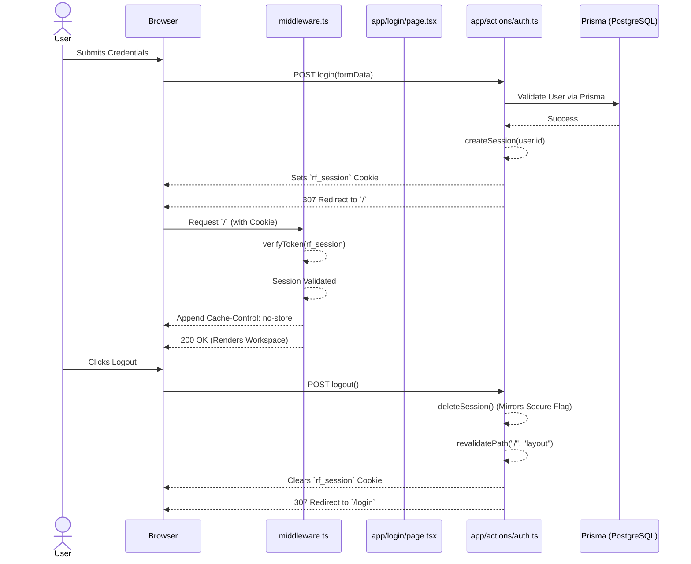

# Authentication Architecture

This document serves as the authoritative reference for the complete authentication system of the Random Frames OS. It accurately reflects the current working and stabilized production implementation.

## Overview

The authentication system employs a bespoke implementation combining Next.js Server Actions, Edge Middleware, JWT tokens via `jose`, and HTTP-Only cookies. It follows a secure, stateless architecture that does not rely on monolithic packages, allowing for finer control over routing, session validation, caching, and database operations.

## Authentication Flow

### Login Sequence
1. The user navigates to `/login`.
2. The `LoginPage` component (`app/login/page.tsx`) captures email and password.
3. The form submits a `FormData` object to the `login` Server Action (`app/actions/auth.ts`).
4. The Server Action queries the PostgreSQL database via Prisma to locate the user and verify active status.
5. The password is cryptographically verified via `bcrypt.compare`.
6. Upon success, `createSession(userId)` generates a JWT and binds it to a Secure, HTTP-Only cookie.
7. The Server Action issues a `redirect("/")`, securely pushing the user to the protected workspace.

### Logout Sequence
1. The user invokes the logout action from the profile dropdown.
2. The `logout` Server Action (`app/actions/auth.ts`) executes `deleteSession()`, securely stripping the session cookie across all environments.
3. The Server Action invokes `revalidatePath("/", "layout")` to forcibly purge the Next.js Client-side Router Cache.
4. The Server Action issues a `redirect("/login")`.
5. If the user clicks the browser Back button, the middleware intercept combined with strict `Cache-Control` headers prevents the Back/Forward cache (bfcache) from restoring the protected page.

## Session Lifecycle

### JWT Lifecycle
Sessions are represented strictly by JSON Web Tokens (JWTs) generated using the `jose` library. 
- **Algorithm:** `HS256`
- **Payload:** `{ userId: string }`
- **Secret Key:** `process.env.JWT_SECRET`
- **Expiration:** 24 hours (`1d`)
- **Lifecycle:** Issued on login, stateless (no DB storage required), naturally expires after 24 hours, rejected by Edge middleware immediately upon expiration.

### Cookie Lifecycle
The resulting JWT is bound to an HTTP-Only cookie named `rf_session`.
- **`httpOnly: true`**: Prevents client-side scripts from reading the session.
- **`secure: process.env.NODE_ENV === "production"`**: Enforces HTTPS in production.
- **`sameSite: "lax"`**: Mitigates Cross-Site Request Forgery (CSRF).
- **`path: "/"`**: Allows session propagation across all routes.
- **Lifecycle:** Created by `createSession()`, sent with every request, deleted by `deleteSession()` which meticulously mirrors identical cookie creation attributes to ensure destruction in strict browsers.

## Route Protection & Middleware

### Middleware Responsibilities (`middleware.ts`)
The Edge runtime middleware acts as the primary gatekeeper, executing **before** Next.js resolves any React component.

1. **Extraction:** Attempts to extract the `rf_session` cookie from the incoming request.
2. **Validation:** Decrypts and validates the token using `verifyToken(token)`. Resolves to `null` if tampered, missing, or expired.
3. **Enforcement:**
   - **Protected Route Access (Unauthenticated):** Returns a `307 Temporary Redirect` to `/login`.
   - **Public Route Access (Authenticated):** Returns a `307 Temporary Redirect` to `/dashboard`.
4. **Cache Invalidation:** For all protected (non-public) routes, dynamically appends `Cache-Control: no-store, max-age=0` to the response headers to completely disable browser disk/memory caching and bfcache.

### Public Routes
Defined strictly within `middleware.ts`, public routes bypass authentication requirements.
- `/login`
- `/forgot-password`
- `/reset-password`

*(Note: Static assets `/_next/*`, image optimisations, and system API webhooks `/api/webhooks/*` are globally bypassed before the authentication logic executes to preserve performance and CDN caching).*

### Protected Routes
Everything that is not explicitly declared as a public route is protected by default.

## Cache Strategy

To prevent users from navigating "back" to a logged-in state after a logout, the following dual-layer cache prevention strategy is utilized:
1. **Next.js Router Cache Invalidation:** `revalidatePath("/", "layout")` is explicitly fired during the logout Server Action. This ensures Next.js purges its in-memory React Server Component (RSC) cache.
2. **Browser bfcache Prevention:** `middleware.ts` forces `Cache-Control: no-store, max-age=0` on all protected HTML/RSC responses. This ensures native browser mechanisms (like the Back button) cannot resurrect stale protected documents without triggering a middleware re-evaluation.

## Security Considerations

1. **Stateless Scalability:** JWT validation occurs on the Edge without incurring a PostgreSQL database roundtrip, maintaining high performance under load.
2. **XSS & CSRF Mitigation:** `rf_session` is `httpOnly` and `SameSite=Lax`, protecting against both cross-site scripting and cross-site request forgery.
3. **Password Security:** Passwords are never logged and are hashed via `bcrypt` at a robust complexity level.
4. **Production Cookie Consistency:** Cookie invalidation uses matching parameters (`secure`, `path`, `sameSite`), preventing rogue lingering sessions in production browsers (e.g. Chrome).

## Troubleshooting Guide

- **Login succeeds but immediately returns to `/login`:** Check if `process.env.JWT_SECRET` is synchronized across all environments. If it differs between API and Middleware, JWT verification will silently fail.
- **Logout works locally but fails in Production:** Ensure that the `deleteSession()` function explicitly sets `secure: process.env.NODE_ENV === "production"`. Without this, production browsers reject the `Set-Cookie` deletion request.
- **Pressing the Back button after logout reveals the dashboard:** Ensure `middleware.ts` is correctly appending the `Cache-Control: no-store` header to protected routes, and that `revalidatePath("/", "layout")` is executing inside the `logout` action.

## Architecture Sequence Diagram

## Best Practices for Future Development

1. **Maintain Single Source of Truth:** `lib/auth.ts` remains the singular authority on session management. Never duplicate `jwtVerify` or `cookies().set` in other files.
2. **Preserve Middleware Performance:** Never introduce `prisma` or heavy database calls into `middleware.ts`. It must remain lean and Edge-compatible.
3. **Dead Code Housekeeping:** Ensure unreachable fallback components (like `<LandingPage />` in `app/page.tsx` for unauthenticated sessions) are eventually pruned, as middleware guarantees they will never render.
4. **Static Route Exclusions:** If introducing new public static files or public API webhooks, explicitly exclude them early in `middleware.ts` to prevent JWT verification overhead and maintain CDN cacheability.
